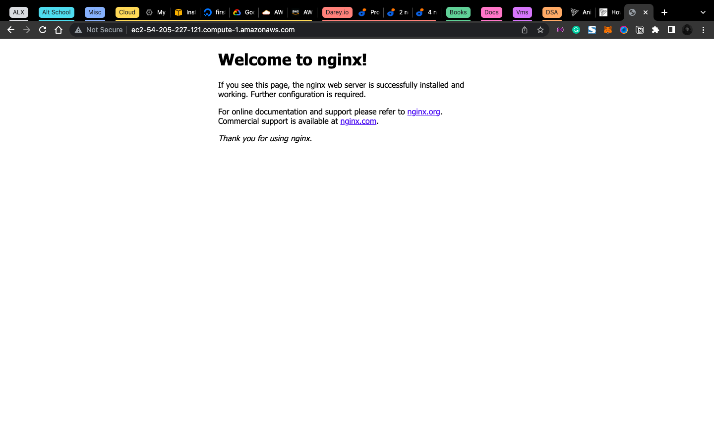
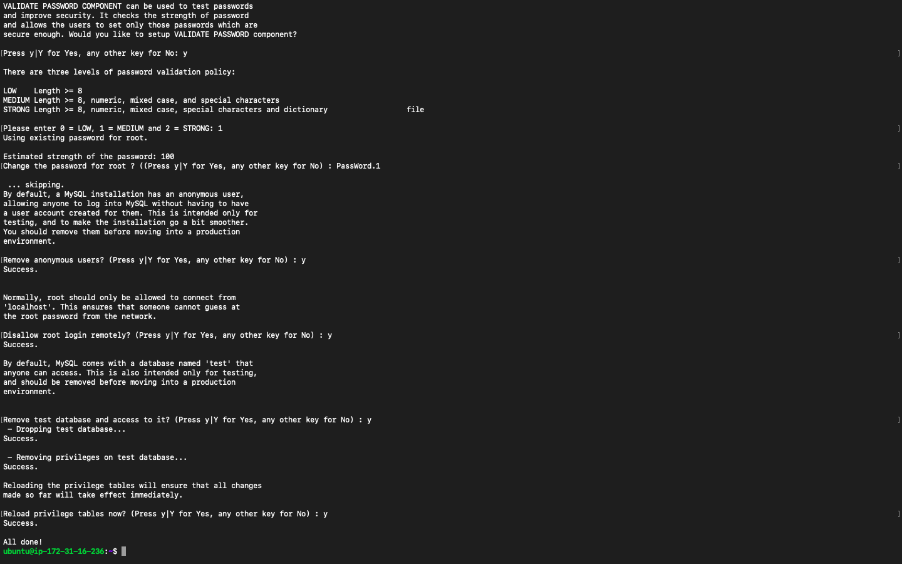
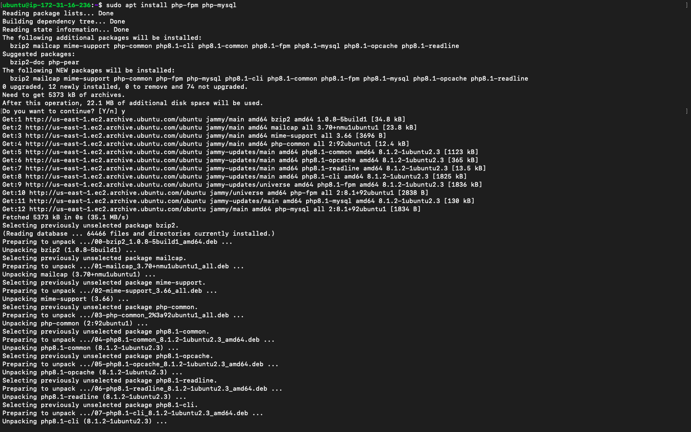
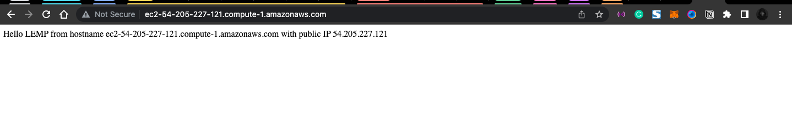
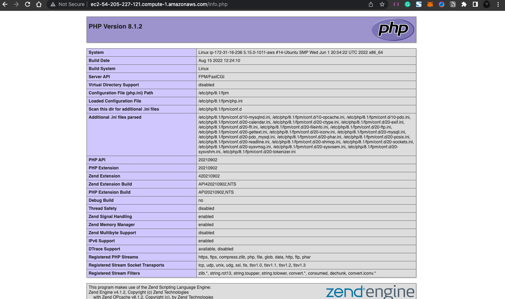
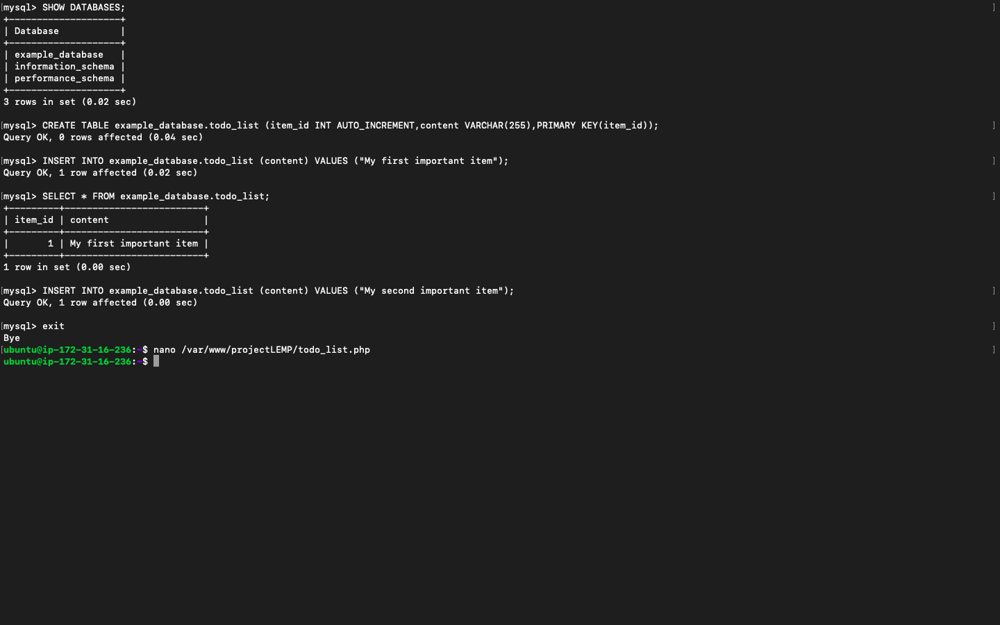

# PROJECT 2: LEMP STACK IMPLEMENTATION

## STEP 1 – INSTALLING THE NGINX WEB SERVER

- Run

```bash
sudo apt update
sudo apt install nginx
```

- To verify that nginx was successfully installed and is running as a service in Ubuntu, run: `sudo systemctl status nginx`


- Open a web browser of your choice and try to access following url `http://<Public-IP-Address>:80`



> Another way to retrieve your Public IP address, other than to check it in AWS Web console, is to use following command: `curl -s http://169.254.169.254/latest/meta-data/public-ipv4`

## STEP 2 — INSTALLING MYSQL

```bash
sudo apt install mysql-server
sudo mysql
```


```sql
ALTER USER 'root'@'localhost' IDENTIFIED WITH mysql_native_password BY 'PassWord.1';
exit
```

- Run `sudo mysql_secure_installation` and follow the instruction. This will ask if you want to configure the `VALIDATE PASSWORD PLUGIN`.



- When you are done with the previous command, run `sudo mysql -p` to login and `exit` to leave SQL prompt.

## STEP 3 – INSTALLING PHP

- Run `sudo apt install php-fpm php-mysql`



## STEP 4 — CONFIGURING NGINX TO USE PHP PROCESSOR

> When using the Nginx web server, we can create server blocks (similar to virtual hosts in Apache) to encapsulate configuration details and host more than one domain on a single server. In this guide, we will use projectLEMP as an example domain name.

> On Ubuntu 20.04, Nginx has one server block enabled by default and is configured to serve documents out of a directory at `/var/www/html`. While this works well for a single site, it can become difficult to manage if you are hosting multiple sites. Instead of modifying `/var/www/html`, we’ll create a directory structure within `/var/www` for the your_domain website, leaving `/var/www/html` in place as the default directory to be served if a client request does not match any other sites.

- Create the root web directory for your_domain as follows: `sudo mkdir /var/www/projectLEMP`

- Next, assign ownership of the directory with the $USER environment variable, which will reference your current system user: `sudo chown -R $USER:$USER /var/www/projectLEMP`

- Then, open a new configuration file in Nginx’s sites-available directory using your preferred command-line editor. Here, we’ll use nano: `sudo nano /etc/nginx/sites-available/projectLEMP`

> This will create a new blank file. Paste in the following bare-bones configuration: `/etc/nginx/sites-available/projectLEMP`

```config
server {
    listen 80;
    server_name projectLEMP www.projectLEMP;
    root /var/www/projectLEMP;

    index index.html index.htm index.php;

    location / {
        try_files $uri $uri/ =404;
    }

    location ~ \.php$ {
        include snippets/fastcgi-php.conf;
        fastcgi_pass unix:/var/run/php/php8.1-fpm.sock;
     }

    location ~ /\.ht {
        deny all;
    }

}
```

##### Here’s what each of these directives and location blocks do:

- `listen` — Defines what port Nginx will listen on. In this case, it will listen on port 80, the default port for HTTP.

- `root` — Defines the document root where the files served by this website are stored.

- `index` — Defines in which order Nginx will prioritize index files for this website. It is a common practice to list index.html files with a higher precedence than index.php files to allow for quickly setting up a maintenance landing page in PHP applications. You can adjust these settings to better suit your application needs.

- `server_name` — Defines which domain names and/or IP addresses this server block should respond for. Point this directive to your server’s domain name or public IP address.

- `location /` — The first location block includes a try_files directive, which checks for the existence of files or directories matching a URI request. If Nginx cannot find the appropriate resource, it will return a 404 error.

- `location ~ \.php$` — This location block handles the actual PHP processing by pointing Nginx to the fastcgi-php.conf configuration file and the php7.4-fpm.sock file, which declares what socket is associated with php-fpm.

- `location ~ /\.ht` — The last location block deals with .htaccess files, which Nginx does not process. By adding the deny all directive, if any .htaccess files happen to find their way into the document root ,they will not be served to visitors.

- When you’re done editing, save and close the file. If you’re using `nano`, you can do so by typing `CTRL+X` and then `y` and `ENTER `to confirm.

- Activate your configuration by linking to the config file from Nginx’s sites-enabled directory:

`sudo ln -s /etc/nginx/sites-available/projectLEMP /etc/nginx/sites-enabled/`

This will tell Nginx to use the configuration next time it is reloaded. You can test your configuration file for syntax errors by typing: `sudo nginx -t`

You shall see following message:

```bash
nginx: the configuration file /etc/nginx/nginx.conf syntax is ok
nginx: configuration file /etc/nginx/nginx.conf test is successful
```

> If any errors are reported, go back to your configuration file to review its contents before continuing.

- We also need to disable default Nginx host that is currently configured to listen on port 80, for this run: `sudo unlink /etc/nginx/sites-enabled/default`

- When you are ready, reload Nginx to apply the changes: `sudo systemctl reload nginx`

- Your new website is now active, but the web root `/var/www/projectLEMP` is still empty. Create an `index.html` file in that location so that we can test that your new server block works as expected:

`sudo echo 'Hello LEMP from hostname' $(curl -s http://169.254.169.254/latest/meta-data/public-hostname) 'with public IP' $(curl -s http://169.254.169.254/latest/meta-data/public-ipv4) > /var/www/projectLEMP/index.html`

- Now go to your browser and try to open your website URL using IP address: `http://<Public-IP-Address>:80`



> If you see the text from ‘echo’ command you wrote to index.html file, then it means your Nginx site is working as expected.

> In the output you will see your server’s public hostname (DNS name) and public IP address. You can also access your website in your browser by public DNS name, not only by IP – try it out, the result must be the same (port is optional)

`http://<Public-DNS-Name>:80`

> You can leave this file in place as a temporary landing page for your application until you set up an `index.php` file to replace it. Once you do that, remember to remove or rename the `index.html` file from your document root, as it would take precedence over an `index.php` file by default.

> Your LEMP stack is now fully configured. In the next step, we’ll create a PHP script to test that Nginx is in fact able to handle `.php` files within your newly configured website.

## STEP 5 – TESTING PHP WITH NGINX

> At this point, your LAMP stack is completely installed and fully operational.

> You can test it to validate that Nginx can correctly hand `.php` files off to your PHP processor.

- You can do this by creating a test PHP file in your document root. Open a new file called info.php within your document root in your text editor:

`sudo nano /var/www/projectLEMP/info.php`

- Type or paste the following lines into the new file. This is valid PHP code that will return information about your server:

```php
<?php
phpinfo();
```



- You can now access this page in your web browser by visiting the domain name or public IP address you’ve set up in your Nginx configuration file, followed by /info.php: `http://`server_domain_or_IP`/info.php`

> After checking the relevant information about your PHP server through that page, it’s best to remove the file you created as it contains sensitive information about your PHP environment and your Ubuntu server. You can use rm to remove that file: `sudo rm /var/www/your_domain/info.php`

## STEP 6 – RETRIEVING DATA FROM MYSQL DATABASE WITH PHP (CONTINUED)

- run `sudo mysql`

- run

```sql
CREATE DATABASE `example_database`;
CREATE USER 'example_user'@'%' IDENTIFIED WITH mysql_native_password BY 'password';
GRANT ALL ON example_database.* TO 'example_user'@'%';
exit
```

- You can test if the new user has the proper permissions by logging in to the MySQL console again, this time using the custom user credentials: `mysql -u example_user -p`


- Once logged in, run

```sql
SHOW DATABASES;

# we’ll create a test table named todo_list

CREATE TABLE example_database.todo_list (
mysql>     item_id INT AUTO_INCREMENT,
mysql>     content VARCHAR(255),
mysql>     PRIMARY KEY(item_id)
mysql> );

INSERT INTO example_database.todo_list (content) VALUES ("My first important item");

SELECT * FROM example_database.todo_list;

exit
```



- Now you can create a PHP script that will connect to MySQL and query for your content. Create a new PHP file in your custom web root directory using your preferred editor. We’ll use vi for that: `nano /var/www/projectLEMP/todo_list.php`

- Copy this content into your todo_list.php script:

```php
<?php
$user = "example_user";
$password = "password";
$database = "example_database";
$table = "todo_list";

try {
  $db = new PDO("mysql:host=localhost;dbname=$database", $user, $password);
  echo "<h2>TODO</h2><ol>";
  foreach($db->query("SELECT content FROM $table") as $row) {
    echo "<li>" . $row['content'] . "</li>";
  }
  echo "</ol>";
} catch (PDOException $e) {
    print "Error!: " . $e->getMessage() . "<br/>";
    die();
}
```


- You can now access this page in your web browser by visiting the domain name or public IP address configured for your website, followed by /todo_list.php: `http://<Public_domain_or_IP>/todo_list.php`


