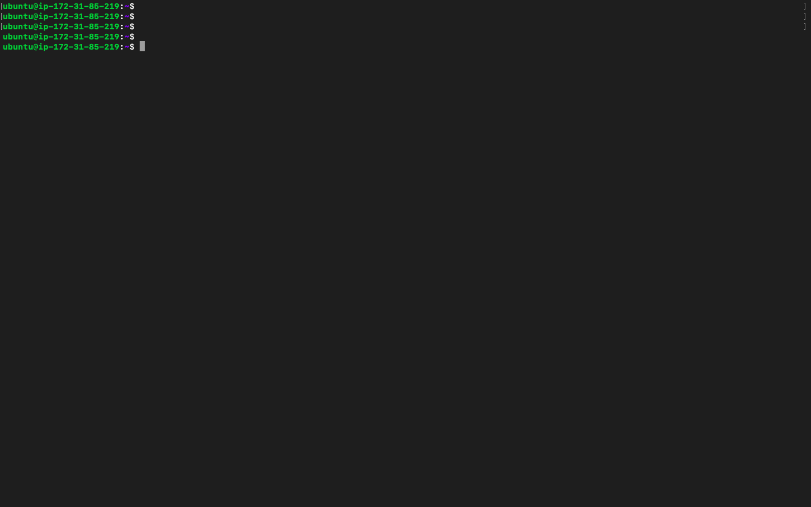
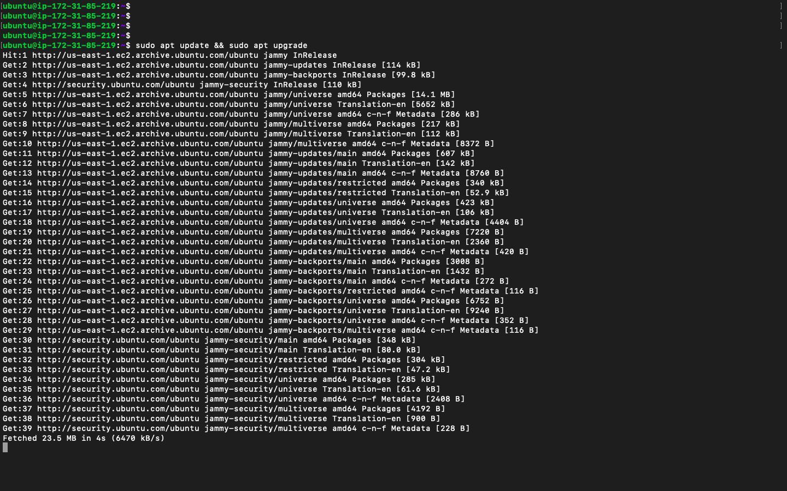
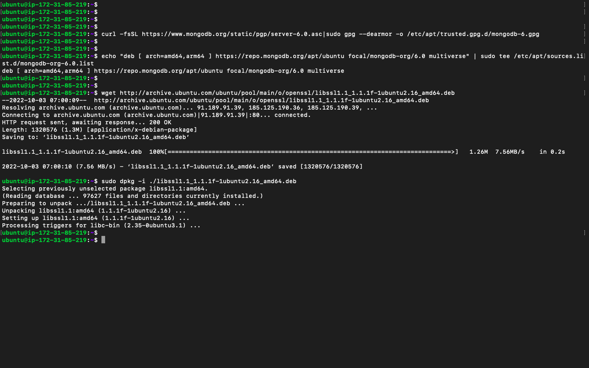
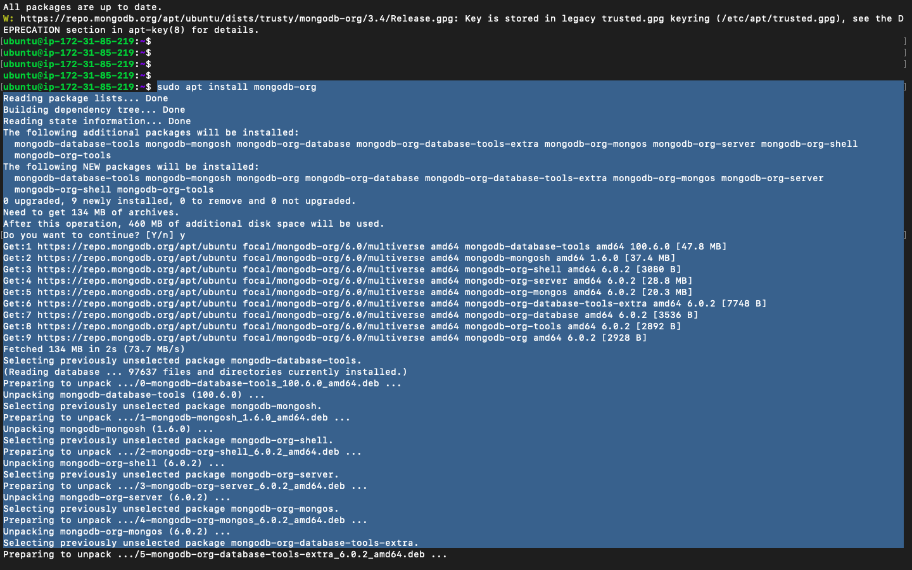
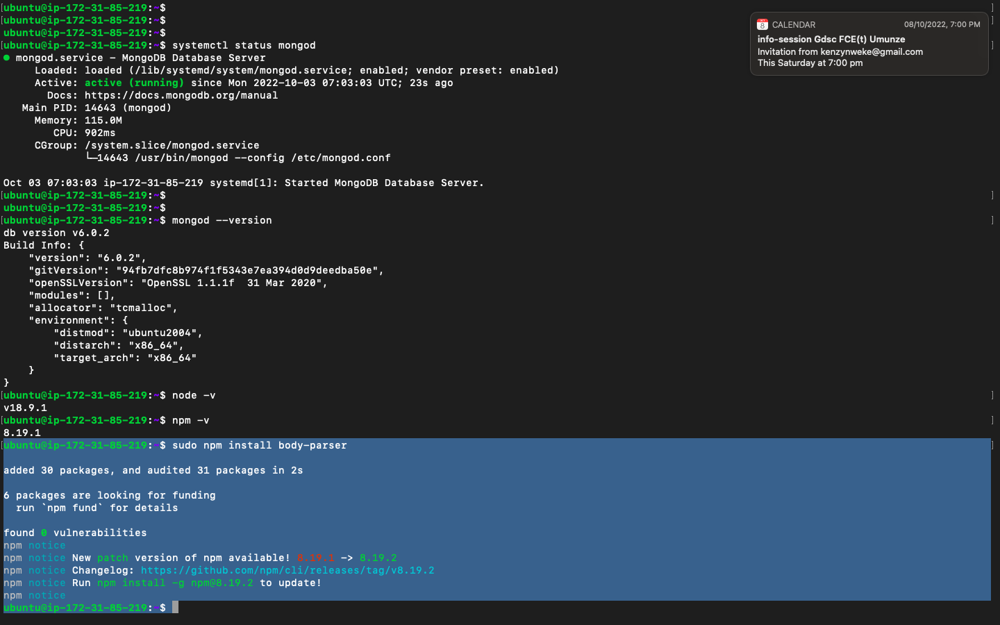

# PROJECT 4 - MEAN STACK DEPLOYMENT TO UBUNTU IN AWS

## INITIAL SETUP

- Setup AWS EC2 instance
- Connect to it via CLI

- run :

```bash
sudo apt update && sudo apt upgrade
```



- Add certificates

```bash
sudo apt -y install curl dirmngr apt-transport-https lsb-release ca-certificates
```


- Install Node.js

```bash
curl -sL https://deb.nodesource.com/setup_18.x | sudo -E bash -
sudo apt install -y nodejs
```


## INSTALL MONGODB

### OPTION 1 - I didn't use this

- run the following commands

```bash
# Apt-key is deprecated on ubuntu 22
sudo apt-key adv --keyserver hkp://keyserver.ubuntu.com:80 --recv 0C49F3730359A14518585931BC711F9BA15703C6

echo "deb [ arch=amd64 ] https://repo.mongodb.org/apt/ubuntu trusty/mongodb-org/3.4 multiverse" | sudo tee /etc/apt/sources.list.d/mongodb-org-3.4.list

sudo apt install -y mongodb

# Start The server

sudo service mongodb start

# Verify that the service is up and running

sudo systemctl status mongodb
```

### OPTION 2

- Install the required packages

```bash
sudo apt install wget curl gnupg2 software-properties-common apt-transport-https ca-certificates lsb-release
```


- Run the following command to import the MongoDB public GPG Key:

```bash
curl -fsSL https://www.mongodb.org/static/pgp/server-6.0.asc|sudo gpg --dearmor -o /etc/apt/trusted.gpg.d/mongodb-6.gpg
```



- Using the following commands, add the mongodb repository to your system right away:

```bash
echo "deb [ arch=amd64,arm64 ] https://repo.mongodb.org/apt/ubuntu focal/mongodb-org/6.0 multiverse" | sudo tee /etc/apt/sources.list.d/mongodb-org-6.0.list
```

- Once the appropriate repository has been added, use the following command to install MongoDB 6.0 on Ubuntu.

```bash
wget http://archive.ubuntu.com/ubuntu/pool/main/o/openssl/libssl1.1_1.1.1f-1ubuntu2.16_amd64.deb sudo dpkg -i ./libssl1.1_1.1.1f-1ubuntu2.16_amd64.deb sudo apt update sudo apt install mongodb-org
```


- After installation run

```bash
sudo systemctl enable --now mongod
systemctl status mongod
```


## INSTALL EXPRESS AND SET UP ROUTES TO THE SERVER

- run `mkdir Books && cd Books`
- run `npm init`
- Install body-parser package. We need ‘body-parser’ package to help us process JSON files passed in requests to the server.\
  `sudo npm install body-parser`

  

- run `sudo npm install express mongoose`
- In `Books` folder, create a folder named `apps` \
  `mkdir apps && cd apps`

  


- Create a file named `routes.js` and pasted the following code in it

```javascript
var Book = require("./models/book");
module.exports = function (app) {
  app.get("/book", function (req, res) {
    Book.find({}, function (err, result) {
      if (err) throw err;
      res.json(result);
    });
  });
  app.post("/book", function (req, res) {
    var book = new Book({
      name: req.body.name,
      isbn: req.body.isbn,
      author: req.body.author,
      pages: req.body.pages,
    });
    book.save(function (err, result) {
      if (err) throw err;
      res.json({
        message: "Successfully added book",
        book: result,
      });
    });
  });
  app.delete("/book/:isbn", function (req, res) {
    Book.findOneAndRemove(req.query, function (err, result) {
      if (err) throw err;
      res.json({
        message: "Successfully deleted the book",
        book: result,
      });
    });
  });
  var path = require("path");
  app.get("*", function (req, res) {
    res.sendfile(path.join(__dirname + "/public", "index.html"));
  });
};
```

- In the `apps` folder, create a folder named `models`
- Create a file named `book.js`
- Paste this code below into `book.js`


```javascript
var mongoose = require("mongoose");
var dbHost = "mongodb://localhost:27017/test";
mongoose.connect(dbHost);
mongoose.connection;
mongoose.set("debug", true);
var bookSchema = mongoose.Schema({
  name: String,
  isbn: { type: String, index: true },
  author: String,
  pages: Number,
});
var Book = mongoose.model("Book", bookSchema);
module.exports = mongoose.model("Book", bookSchema);
```

### ACCESS THE ROUTES WITH ANGULARJS


- Change the directory back to `Books`
- Create a folder named `public`
- Add a file named `script.js`
- Copy and paste the Code below (controller configuration defined) into the script.js file.

```javascript
var app = angular.module("myApp", []);
app.controller("myCtrl", function ($scope, $http) {
  $http({
    method: "GET",
    url: "/book",
  }).then(
    function successCallback(response) {
      $scope.books = response.data;
    },
    function errorCallback(response) {
      console.log("Error: " + response);
    }
  );
  $scope.del_book = function (book) {
    $http({
      method: "DELETE",
      url: "/book/:isbn",
      params: { isbn: book.isbn },
    }).then(
      function successCallback(response) {
        console.log(response);
      },
      function errorCallback(response) {
        console.log("Error: " + response);
      }
    );
  };
  $scope.add_book = function () {
    var body =
      '{ "name": "' +
      $scope.Name +
      '", "isbn": "' +
      $scope.Isbn +
      '", "author": "' +
      $scope.Author +
      '", "pages": "' +
      $scope.Pages +
      '" }';
    $http({
      method: "POST",
      url: "/book",
      data: body,
    }).then(
      function successCallback(response) {
        console.log(response);
      },
      function errorCallback(response) {
        console.log("Error: " + response);
      }
    );
  };
});
```

- In `public` folder, create a file named `index.html`
- Cpoy and paste the code below into the file

```html
<!DOCTYPE html>
<html ng-app="myApp" ng-controller="myCtrl">
  <head>
    <script src="https://ajax.googleapis.com/ajax/libs/angularjs/1.6.4/angular.min.js"></script>
    <script src="script.js"></script>
  </head>
  <body>
    <div>
      <table>
        <tr>
          <td>Name:</td>
          <td><input type="text" ng-model="Name" /></td>
        </tr>
        <tr>
          <td>Isbn:</td>
          <td><input type="text" ng-model="Isbn" /></td>
        </tr>
        <tr>
          <td>Author:</td>
          <td><input type="text" ng-model="Author" /></td>
        </tr>
        <tr>
          <td>Pages:</td>
          <td><input type="number" ng-model="Pages" /></td>
        </tr>
      </table>
      <button ng-click="add_book()">Add</button>
    </div>
    <hr />
    <div>
      <table>
        <tr>
          <th>Name</th>
          <th>Isbn</th>
          <th>Author</th>
          <th>Pages</th>
        </tr>
        <tr ng-repeat="book in books">
          <td>{{book.name}}</td>
          <td>{{book.isbn}}</td>
          <td>{{book.author}}</td>
          <td>{{book.pages}}</td>

          <td>
            <input
              type="button"
              value="Delete"
              data-ng-click="del_book(book)"
            />
          </td>
        </tr>
      </table>
    </div>
  </body>
</html>
```

### Conclusion

In the root folder run the command `node server.js` and head over the browser to see the app using the url ` http://<dns>:3300`


