# PROJECT 7 - DEVOPS TOOLING WEBSITE SOLUTION

In this project you will implement a solution that consists of the following components:

- Infrastructure: AWS

- Webserver Linux: Red Hat Enterprise Linux 8

- Database Server: Ubuntu 20.04 + MySQL

- Storage Server: Red Hat Enterprise Linux 8 + NFS Server

- Programming Language: PHP

- Code Repository: GitHub

## STEP 1 – PREPARE NFS SERVER

- Spin up a new EC2 instance with RHEL Linux 8 Operating System.

> - Based on your LVM experience from `Project 6`, Configure LVM on the Server.

> - Instead of formatting the disks as `ext4` you will have to format them as `xfs`

> - Ensure there are 3 Logical Volumes. `lv-opt`, `lv-apps`, and `lv-logs`

> - Create mount points on /mnt directory for the logical volumes as follow:

> - Mount `lv-apps` on `/mnt/apps` – To be used by webservers

> - Mount `lv-logs` on `/mnt/logs` – To be used by webserver logs

> - Mount `lv-opt` on `/mnt/opt` – To be used by Jenkins server in Project 8

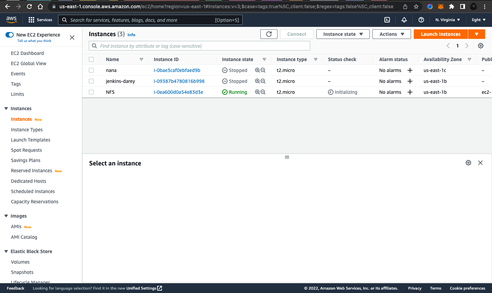

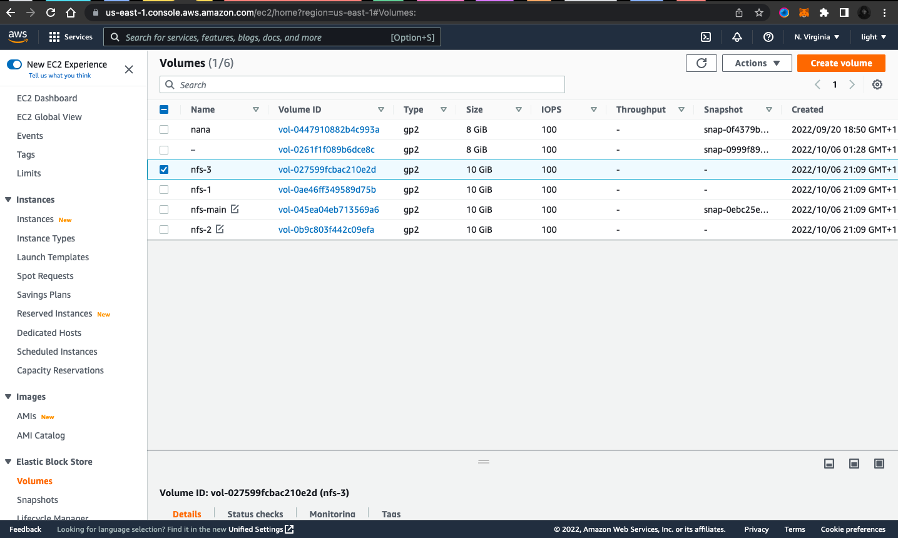

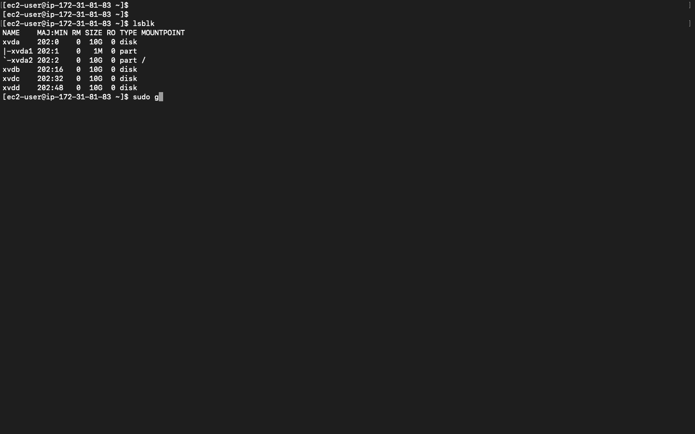


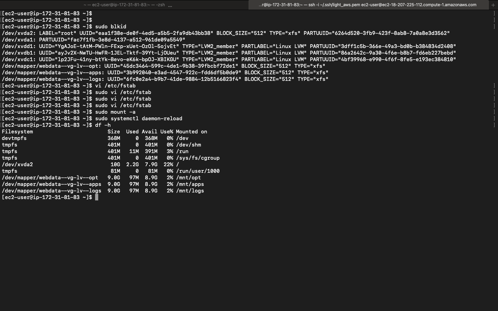

- Install NFS server, configure it to start on reboot, and make sure it is up and running

```bash
sudo yum -y update
sudo yum install nfs-utils -y
sudo systemctl start nfs-server.service
sudo systemctl enable nfs-server.service
sudo systemctl status nfs-server.service
```


- Export the mounts for webservers’ subnet cidr to connect as clients. For simplicity, you will install your all three Web Servers inside the same subnet, but in production set up you would probably want to separate each tier inside its own subnet for higher level of security.

- To check your subnet cidr – open your EC2 details in AWS web console and locate `Networking` tab and open a Subnet link:

- Make sure we set up permission that will allow our Web servers to read, write and execute files on NFS:

```bash
sudo chown -R nobody: /mnt/apps
sudo chown -R nobody: /mnt/logs
sudo chown -R nobody: /mnt/opt

sudo chmod -R 777 /mnt/apps
sudo chmod -R 777 /mnt/logs
sudo chmod -R 777 /mnt/opt

sudo systemctl restart nfs-server.service
```


- Configure access to NFS for clients within the same subnet (example of Subnet CIDR – 172.31.32.0/20):

- Open `/etc/exports` file with `sudo vi /etc/exports` and paste this into it.

```config
/mnt/apps <Subnet-CIDR>(rw,sync,no_all_squash,no_root_squash)
/mnt/logs <Subnet-CIDR>(rw,sync,no_all_squash,no_root_squash)
/mnt/opt <Subnet-CIDR>(rw,sync,no_all_squash,no_root_squash)
```

- run `sudo exportfs -arv`

- Check which port is used by NFS and open it using Security Groups (add new Inbound Rule) by running `rpcinfo -p | grep nfs`

> _Important note:_ In order for NFS server to be accessible from your client, you must also open following ports: TCP 111, UDP 111, UDP 2049

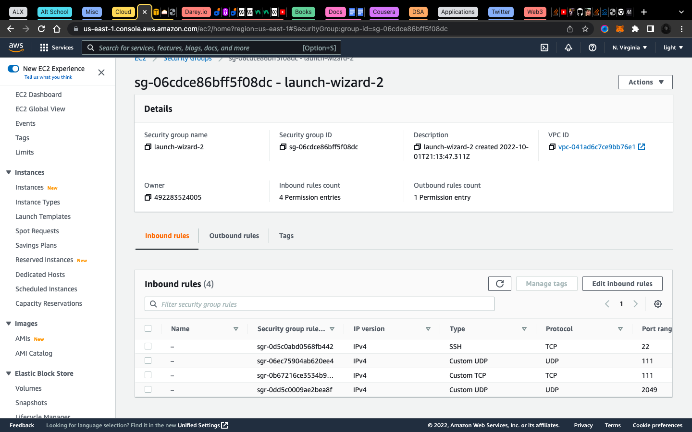

## STEP 2 — CONFIGURE THE DATABASE SERVER

> I won't repeat this section of the documentatio as I have done it in previous projects but images are provided

- Install MySQL server

- Create a database and name it `tooling`

- Create a database user and name it `webaccess`

- Grant permission to `webaccessuser` on `tooling` database to do anything only from the `webservers subnet cidr`

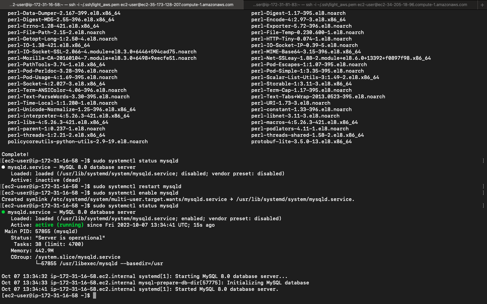


## STEP 3 — PREPARE THE WEB SERVERS

> We need to make sure that our Web Servers can serve the same content from shared storage solutions, in our case – `NFS Server` and `MySQL database`.

> You already know that one DB can be accessed for `reads` and `writes` by multiple clients. For storing shared files that our Web Servers will use – we will utilize NFS and mount previously created Logical Volume lv-apps to the folder where Apache stores files to be served to the users `(/var/www)`.

> This approach will make our Web Servers `stateless`, which means we will be able to add new ones or remove them whenever we need, and the integrity of the data (in the database and on NFS) will be preserved.

- **During the next steps we will do following:**

> - Configure NFS client (this step must be done on all three servers)

> - Deploy a Tooling application to our Web Servers into a shared NFS folder

> - Configure the Web Servers to work with a single MySQL database

1. Launch a new EC2 instance with RHEL 8 Operating System

2. Install NFS client `sudo yum install nfs-utils nfs4-acl-tools -y`

3. Mount `/var/www/` and target the NFS server’s export for apps

```bash
sudo mkdir /var/www
sudo mount -t nfs -o rw,nosuid <NFS-Server-Private-IP-Address>:/mnt/apps /var/www
```

4. Verify that NFS was mounted successfully by running df -h. To make sure that the changes will persist on Web Server after reboot in `sudo vi /etc/fstab` file add following line `<NFS-Server-Private-IP-Address>:/mnt/apps /var/www nfs defaults 0 0`

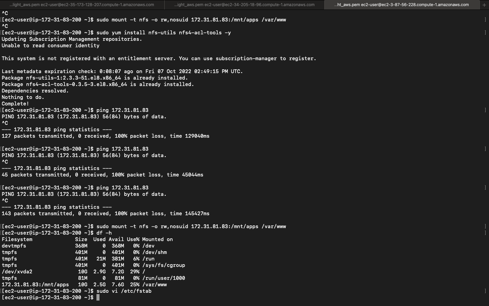

5. Install Remi’s repository, Apache and PHP

```bash
sudo yum install httpd -y

sudo dnf install https://dl.fedoraproject.org/pub/epel/epel-release-latest-8.noarch.rpm

sudo dnf install dnf-utils http://rpms.remirepo.net/enterprise/remi-release-8.rpm

sudo dnf module reset php

sudo dnf module enable php:remi-7.4

sudo dnf install php php-opcache php-gd php-curl php-mysqlnd

sudo systemctl start php-fpm

sudo systemctl enable php-fpm

setsebool -P httpd_execmem 1
```


> Repeat steps 1-5 for another 2 Web Servers.

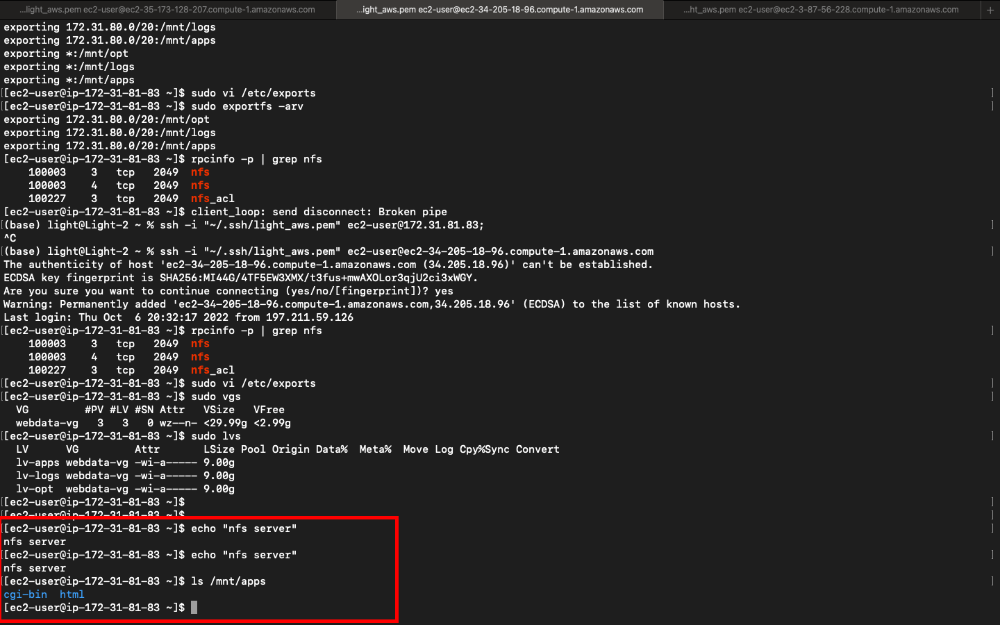


6. Verify that Apache files and directories are available on the Web Server in `/var/www` and also on the NFS server in `/mnt/apps`. If you see the same files – it means NFS is mounted correctly. You can try to create a new file `touch test.txt` from one server and check if the same file is accessible from other Web Servers.

7. Locate the log folder for Apache on the Web Server and mount it to NFS server’s export for logs. Repeat step №4 to make sure the mount point will persist after reboot.

8. Fork the tooling source code from Darey.io Github Account to your Github account. [(Learn how to fork a repo here)](https://github.com/darey-io/tooling.git)

9. Deploy the tooling website’s code to the Webserver. Ensure that the html folder from the repository is deployed to `/var/www/html`

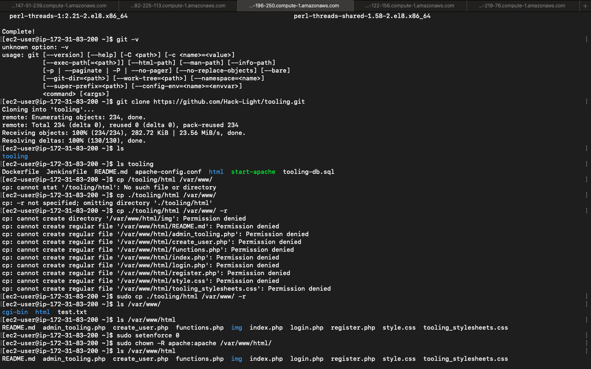

> - **Note 1:** Do not forget to open TCP port 80 on the Web Server.
> - **Note 2:** If you encounter 403 Error – check permissions to your `/var/www/html` folder and also disable SELinux `sudo setenforce 0`
>   To make this change permanent – open following config file `sudo vi /etc/sysconfig/selinux` and set `SELINUX=disabled`then restrt httpd.


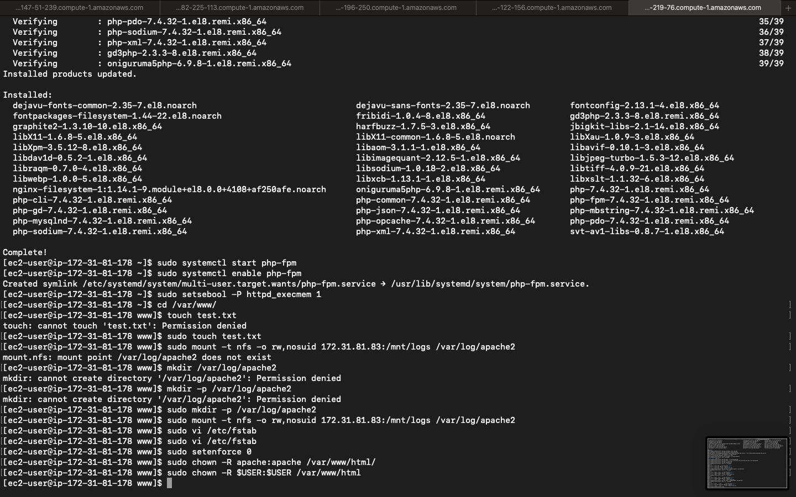


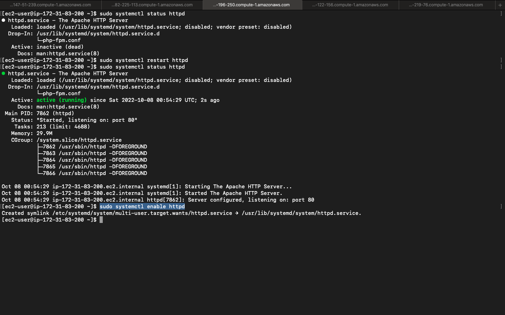

10. Update the website’s configuration to connect to the database (in `/var/www/html/functions.php` file). Apply `tooling-db.sql` script to your database using this command

`mysql -h <databse-private-ip> -u <db-username> -p <db-pasword> < tooling-db.sql`


11. Create in MySQL a new admin user in the `USER TABLE` with username: `myuser` and password: `password`

```sql
INSERT INTO ‘users’ (‘id’, ‘username’, ‘password’, ’email’, ‘user_type’, ‘status’) VALUES (1, ‘myuser’, ‘password’, ‘user@mail.com’, ‘admin’, ‘1’);
```


12. Open the website in your browser `http://<Web-Server-Public-IP-Address-or-Public-DNS-Name>/index.php` and make sure you can login into the websute with myuser user.


**Congratulations!**

_You have just implemented a web solution for a DevOps team using LAMP stack with remote Database and NFS servers._
