# PROJECT 11 - ANSIBLE – AUTOMATE PROJECT 7 TO 10

## INSTALL AND CONFIGURE ANSIBLE ON EC2 INSTANCE

> I had to start a new server, install and configure jenkins

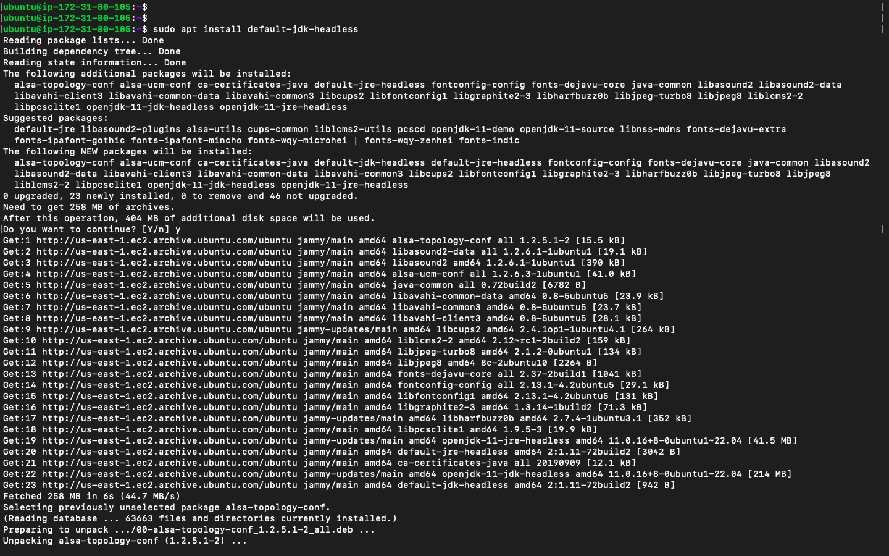


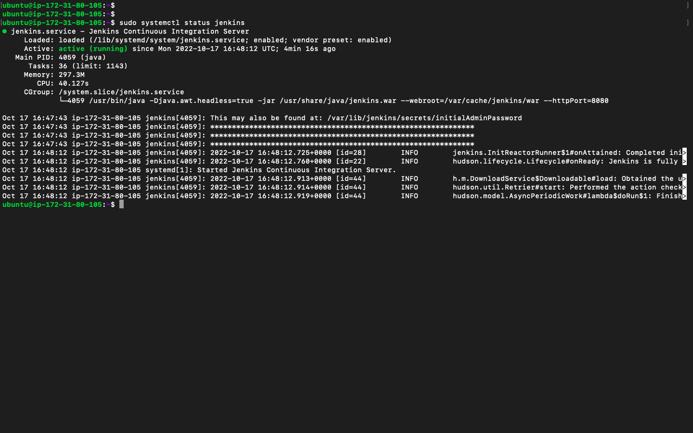

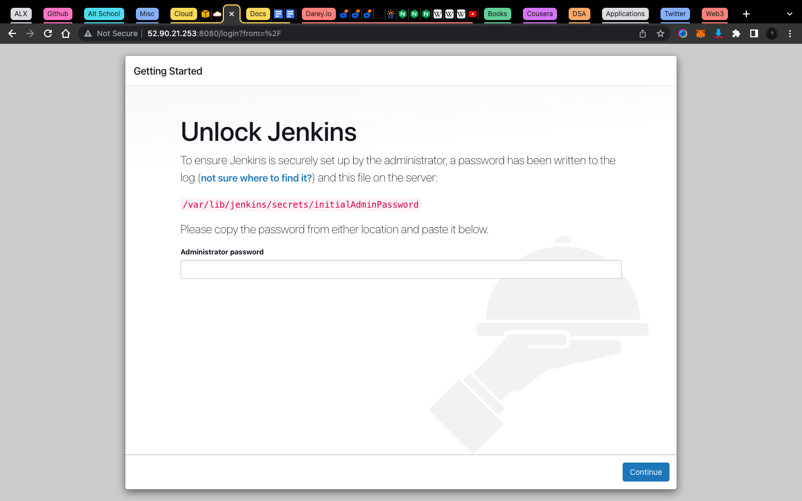


- Update `Name` tag on your Jenkins EC2 Instance to `Jenkins-Ansible`. We will use this server to run playbooks.

- In your GitHub account create a new repository and name it ansible-config-mgt.

- Instal Ansible with:

`sudo apt update`

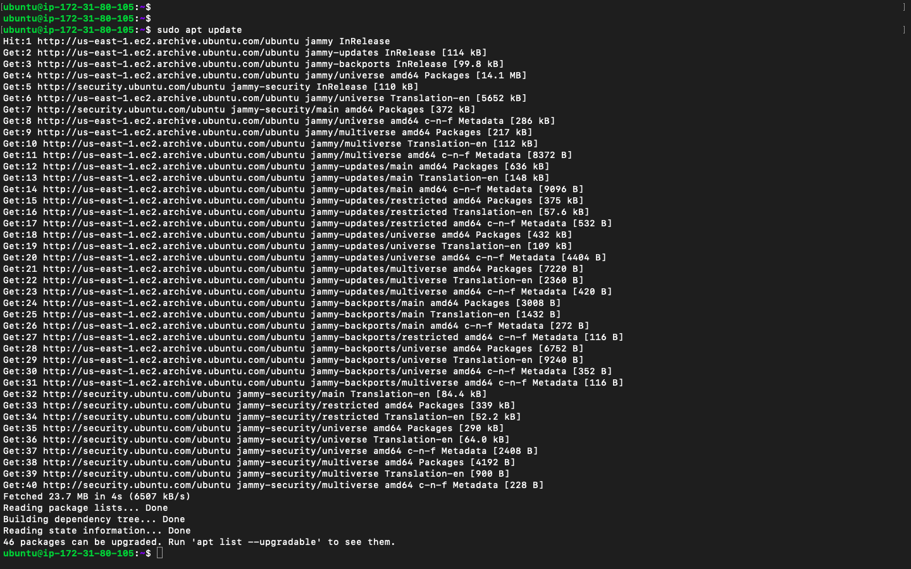

`sudo apt install ansible`


- Check your Ansible version by running `ansible --version`


- Configure Jenkins build job to save your repository content every time you change it – this will solidify your Jenkins configuration skills acquired in `Project 9`.

  - Create a new Freestyle project ansible in Jenkins and point it to your ‘ansible-config-mgt’ repository.

  - Configure Webhook in GitHub and set webhook to trigger ansible build.

  - Configure a Post-build job to save all (`**`) files, like you did it in `Project 9`.

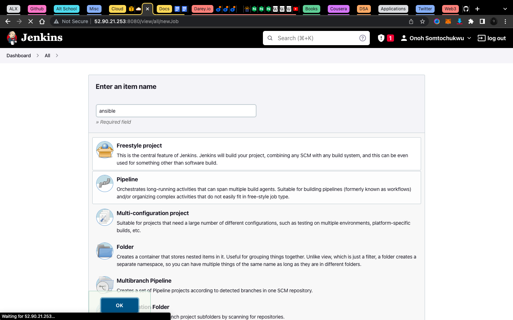

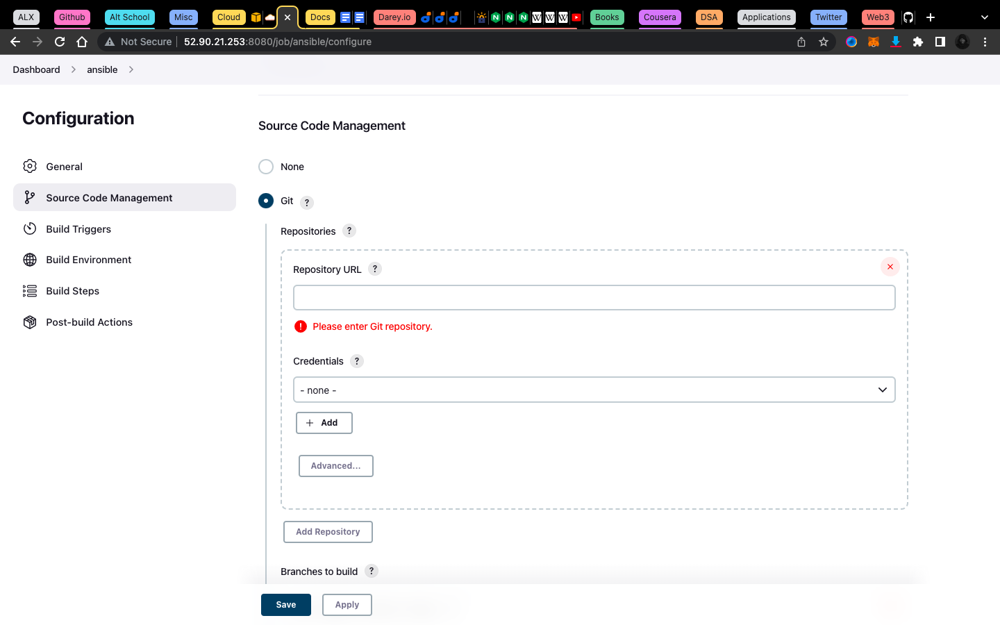


- Test your setup by making some change in README.MD file in master branch and make sure that builds starts automatically and Jenkins saves the files (build artifacts) in following folder `ls /var/lib/jenkins/jobs/ansible/builds/<build_number>/archive/`

> Note: Trigger Jenkins project execution only for /main (master) branch.

- The setup will look like this:

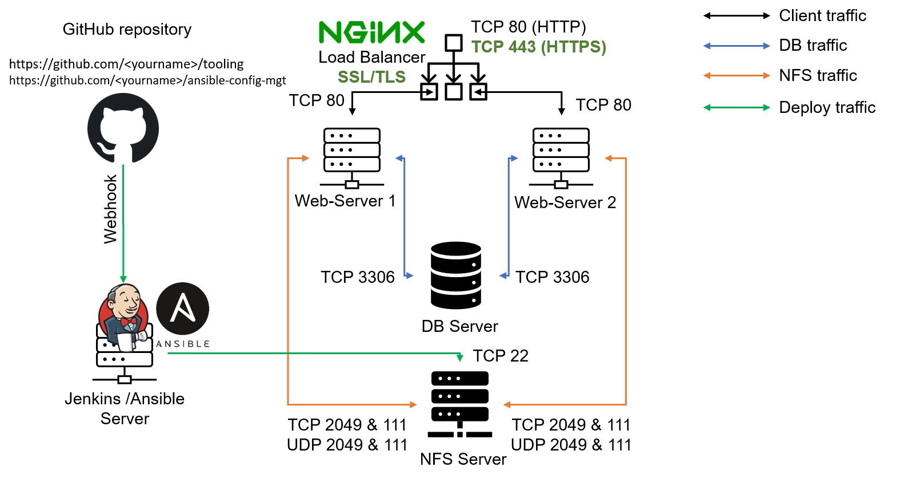

> Tip Every time you stop/start your Jenkins-Ansible server – you have to reconfigure GitHub webhook to a new IP address, in order to avoid it, it makes sense to allocate an Elastic IP to your Jenkins-Ansible server (you have done it before to your LB server in Project 10). Note that Elastic IP is free only when it is being allocated to an EC2 Instance, so do not forget to release Elastic IP once you terminate your EC2 Instance.

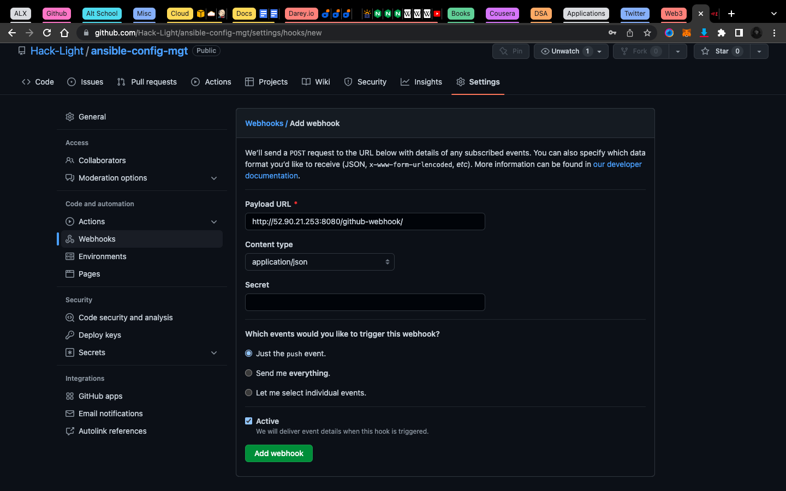


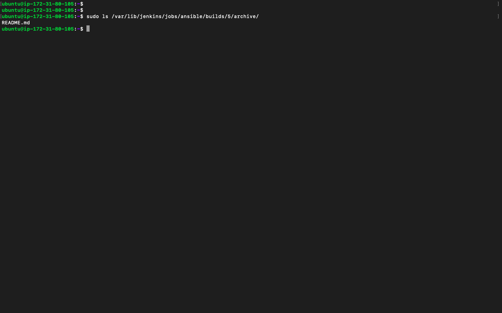

## PREPARE YOUR DEVELOPMENT ENVIRONMENT USING VISUAL STUDIO CODE

> First part of ‘DevOps’ is ‘Dev’, which means you will require to write some codes and you shall have proper tools that will make your coding and debugging comfortable – you need an Integrated development environment (IDE) or Source-code Editor. There is a plethora of different IDEs and Source-code Editors for different languages with their own advantages and drawbacks, you can choose whichever you are comfortable with, but we recommend one free and universal editor that will fully satisfy your needs – Visual Studio Code (VSC), you can get it here.

- After you have successfully installed VSC, configure it to connect to your newly created GitHub repository.

- Clone down your ansible-config-mgt repo to your Jenkins-Ansible instance `git clone <ansible-config-mgt repo link>`


## BEGIN ANSIBLE DEVELOPMENT

- In your ansible-config-mgt GitHub repository, create a new branch that will be used for development of a new feature.

> Tip: Give your branches descriptive and comprehensive names, for example, if you use Jira or Trello as a project management tool – include ticketnumber (e.g. PRJ-145) in the name of your branch and add a topic and a brief description what this branch is about – a bugfix, hotfix, feature, release (e.g. feature/prj-145-lvm)

- Checkout the newly created feature branch to your local machine and start building your code and directory structure

- Create a directory and name it `playbooks` – it will be used to store all your playbook files.Create a directory and name it `inventory` – it will be used to keep your hosts organised.

- Within the `playbooks folder`, create your first playbook, and name it `common.yml`.

- Within the `inventory` folder, create an `inventory` file (.yml) for each environment (Development, Staging Testing and Production) `dev`, `staging`, `uat`, and `prod` respectively.

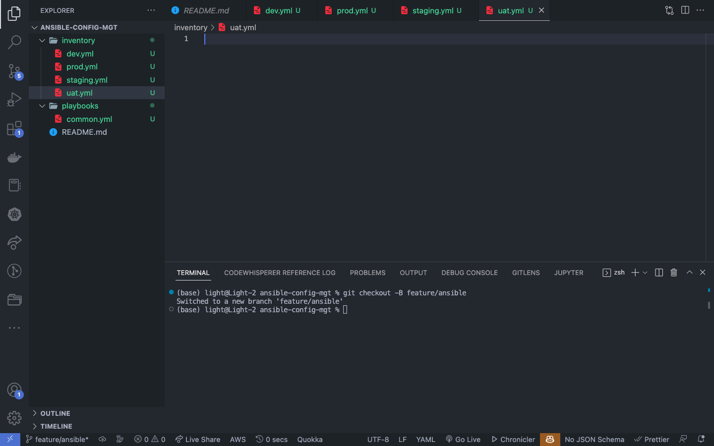

## SET UP AN ANSIBLE INVENTORY

> An Ansible inventory file defines the hosts and groups of hosts upon which commands, modules, and tasks in a playbook operate. Since our intention is to execute Linux commands on remote hosts, and ensure that it is the intended configuration on a particular server that occurs. It is important to have a way to organize our hosts in such an Inventory.

- Save below inventory structure in the `inventory/dev` file to start configuring your development servers. Ensure to replace the IP addresses according to your own setup.

> Note: Ansible uses `TCP port 22` by default, which means it needs to ssh into target servers from Jenkins-Ansible host – for this you can implement the concept of ssh-agent. Now you need to import your key into ssh-agent:

- For Linux users – ssh-agent on linux

`eval 'ssh-agent -s'`

`ssh-add <path-to-private-key>`

- Confirm the key has been added with the command , you should see the name of your key `ssh-add -l`

- Now, ssh into your `Jenkins-Ansible` server using ssh-agent `ssh -A ubuntu@public-ip`

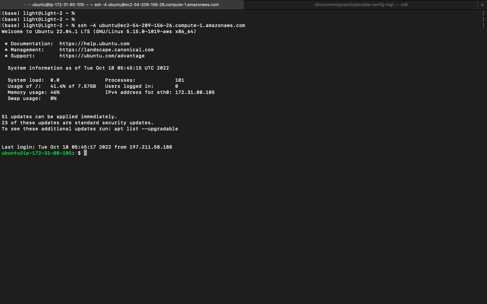

> Also notice, that your Load Balancer user is `ubuntu` and user for RHEL-based servers is `ec2-user`.

- Update your `inventory/dev.yml` file with this snippet of code:

```yaml
[nfs]
<NFS-Server-Private-IP-Address> ansible_ssh_user='ec2-user'

[webservers]
<Web-Server1-Private-IP-Address> ansible_ssh_user='ec2-user'
<Web-Server2-Private-IP-Address> ansible_ssh_user='ec2-user'

[db]
<Database-Private-IP-Address> ansible_ssh_user='ec2-user'

[lb]
<Load-Balancer-Private-IP-Address> ansible_ssh_user='ubuntu'
```

## CREATE A COMMON PLAYBOOK

> It is time to start giving Ansible the instructions on what you needs to be performed on all servers listed ininventory/dev.

> In `common.yml` playbook you will write configuration for repeatable, re-usable, and multi-machine tasks that is common to systems within the infrastructure.

- Update your `playbooks/common.yml`file with following code:

```yaml
---

- name: update web, nfs and db servers
  hosts: webservers, nfs, db
  remote_user: ec2-user
  become: yes
  become_user: root
  tasks:

  - name: ensure wireshark is at the latest version
    yum:
    name: wireshark
    state: latest

- name: update LB server
  hosts: lb
  remote_user: ubuntu
  become: yes
  become_user: root
  tasks: - name: Update apt repo
  apt:
  update_cache: yes

      - name: ensure wireshark is at the latest version
        apt:
          name: wireshark
          state: latest
```


> Examine the code above and try to make sense out of it. This playbook is divided into two parts, each of them is intended to perform the same task: `install wireshark utility (or make sure it is updated to the latest version) on your RHEL 8 and Ubuntu servers`. It uses `root user` to perform this task and respective package manager: `yum for RHEL 8 and apt for Ubuntu.`

> Feel free to update this playbook with following tasks:
>
> - Create a directory and a file inside it
> - Change timezone on all servers
> - Run some shell script

> For a better understanding of Ansible playbooks – watch this video from RedHat and read this article.

## UPDATE GIT WITH THE LATEST CODE

> Now all of your directories and files live on your machine and you need to push changes made locally to GitHub.

> In the real world, you will be working within a team of other DevOps engineers and developers. It is important to learn how to collaborate with help of GIT . In many organisations there is a development rule that do not allow to deploy any code before it has been reviewed by an extra pair of eyes – it is also called `"Four eyes principle"`.

- Now you have a separate branch, you will need to know how to raise a Pull Request (PR), get your branch peer reviewed and merged to the master branch.

- Commit your code into GitHub:

  - use git commands to add, commit and push your branch to GitHub.

```bash
git status
git add <selected files>
git commit -m "commit message"
```


- Create a Pull request (PR)

> Wear a hat of another developer for a second, and act as a reviewer.
> If the reviewer is happy with your new feature development, merge the code to the master branch.


- Head back on your terminal, checkout from the feature branch into the master, and pull down the latest changes.

- Once your code changes appear in `master` branch – Jenkins will do its job and save all the files (build artifacts) to `/var/lib/jenkins/jobs/ansible/builds/<build_number>/archive/` directory on `Jenkins-Ansible`server.

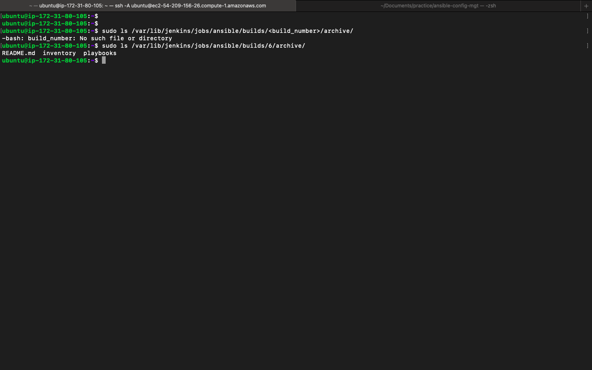

## RUN FIRST ANSIBLE TEST

- Now, it is time to execute ansible-playbook command and verify if your playbook actually works:

```bash
cd ansible-config-mgt
ansible-playbook -i inventory/dev.yml playbooks/common.yml
```

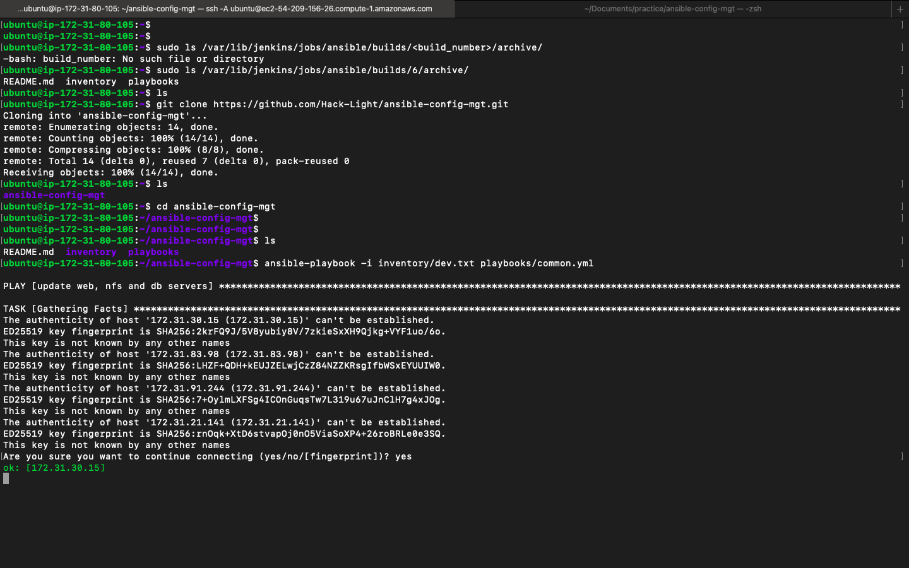

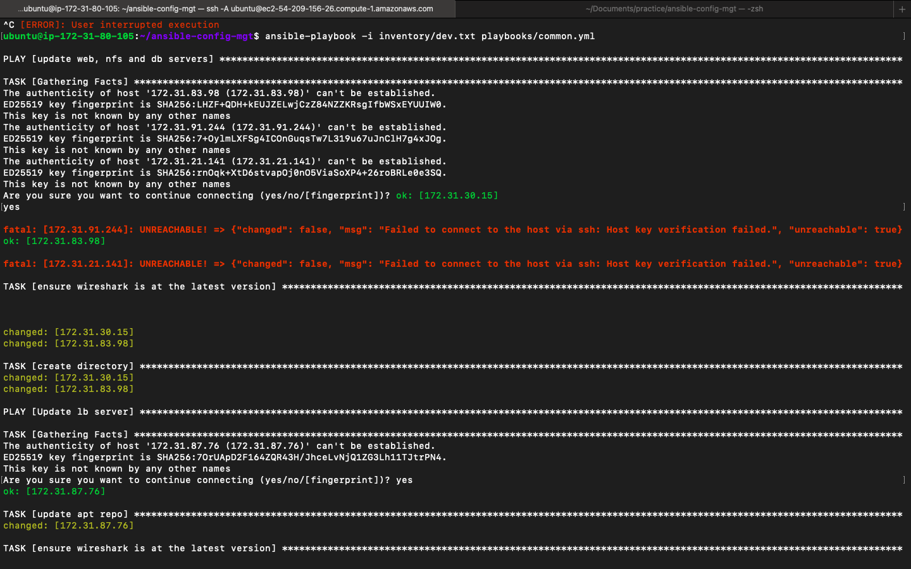


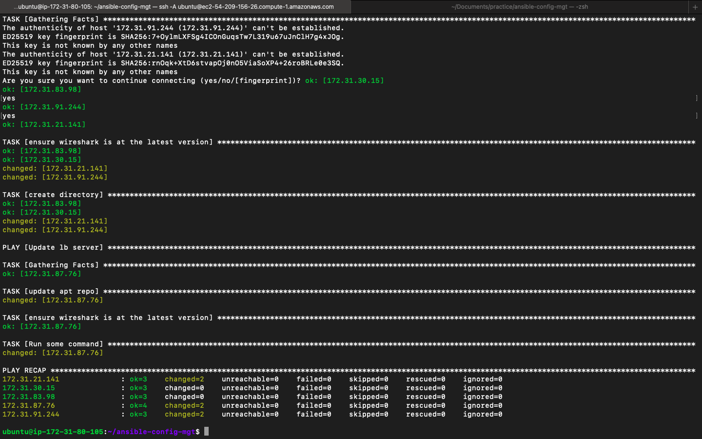

- You can go to each of the servers and check if wireshark has been installed by running `which wireshark` or `wireshark --version`

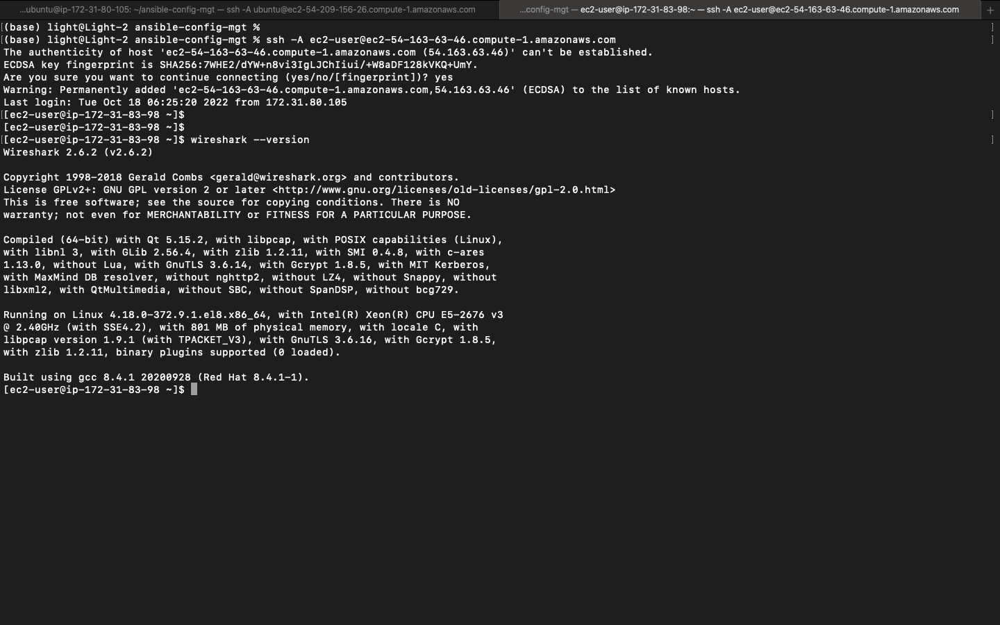

#### Your updated with Ansible architecture now looks like this:

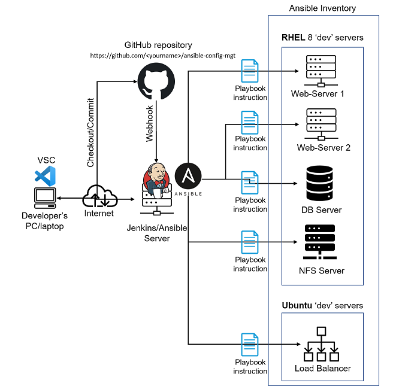

**Congratulations**
_You have just automated your routine tasks by implementing your first Ansible project! There is more exciting projects ahead, so lets keep it moving!_
