# PROJECT 3 - SIMPLE TO-DO APPLICATION ON MERN WEB STACK

In this project, you are tasked to implement a web solution based on MERN stack in AWS Cloud.

MERN Web stack consists of following components:

**MongoDB**: A document-based, No-SQL database used to store application data in a form of documents.

**ExpressJS**: A server side Web Application framework for Node.js.

**ReactJS**: A frontend framework developed by Facebook. It is based on JavaScript, used to build User Interface (UI) components.

**Node.js**: A JavaScript runtime environment. It is used to run JavaScript on a machine rather than in a browser.

## BACKEND CONFIGURATION

Run the folowing commands:

```bash
sudo apt upadate
sudo apt upgrade
curl -fsSL https://deb.nodesource.com/setup_18.x | sudo -E bash - # this is to get the location of node in the ubuntu repo
sudo apt-get install -y nodejs  # to install nodejs and npm on ubuntu
```

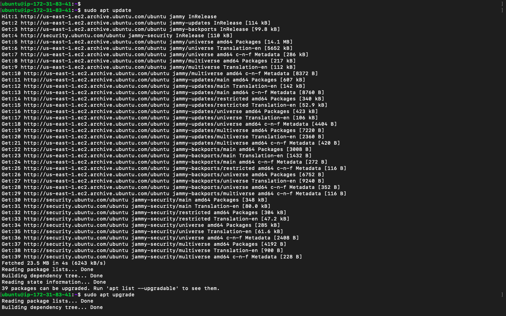

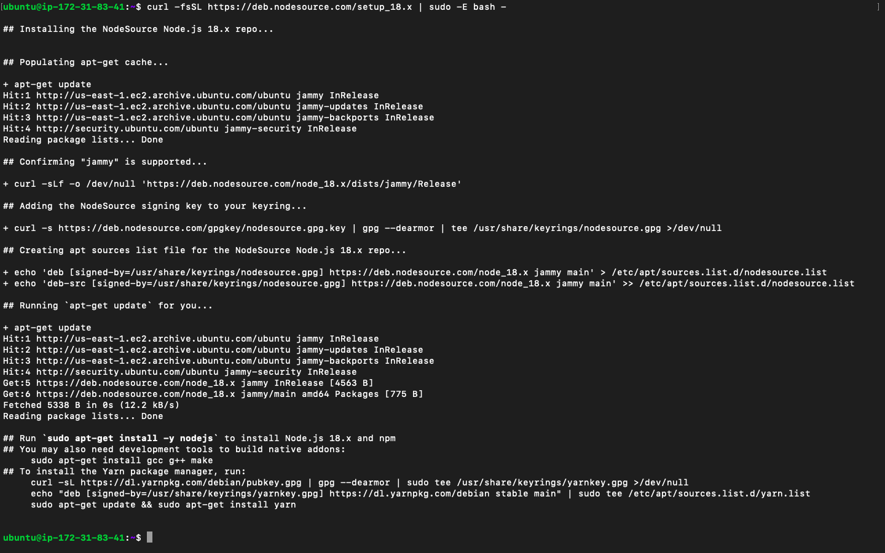


- Create a folder and move into the folder.

- Run `npm init -y` to start a node application.
- Install dependency packages by running `npm i express dotenv`

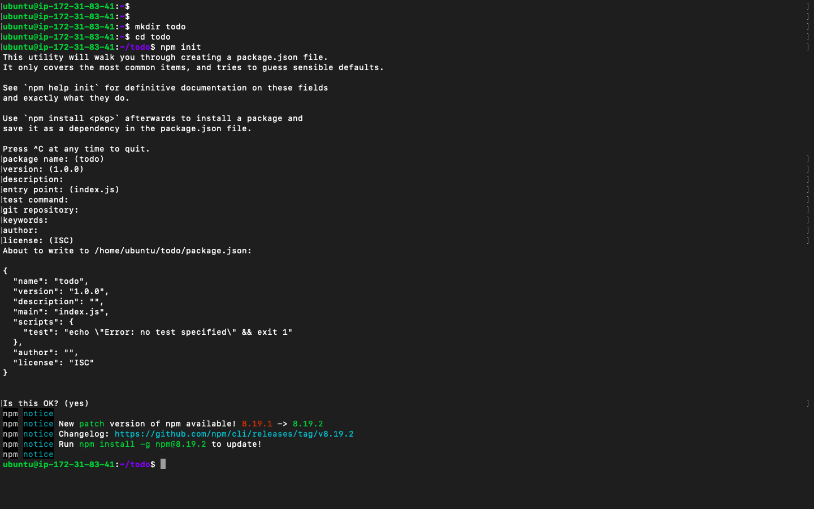

- Create the entry file `index.js` and paste the code into it.

```javascript
const express = require("express");
require("dotenv").config();

const app = express();

const port = process.env.PORT || 5000;

app.use((req, res, next) => {
  res.header("Access-Control-Allow-Origin", "*");
  res.header(
    "Access-Control-Allow-Headers",
    "Origin, X-Requested-With, Content-Type, Accept"
  );
  next();
});

app.use((req, res, next) => {
  res.send("Welcome to Express");
});

app.listen(port, () => {
  console.log(`Server running on port ${port}`);
});
```

- Save file and run `node index.js` to start the express server.
- Open port 5000
- Visit the site port 5000 to see message


> Quick reminder how to get your server’s Public IP and public DNS name:
>
> 1. You can find it in your AWS web console in EC2 details
> 2. Run curl -s http://169.254.169.254/latest/meta-data/public-ipv4 for Public IP address or curl -s http://169.254.169.254/latest/meta-data/public-hostname for Public DNS name.


### ADD OTHER EXPRESS APPLICATION PARTS. - (ROUTES, MONGODB)

> The rest of the process is about the development process, and I didn't put more emphasis on that.

Below are screenshots of commands that I ran.

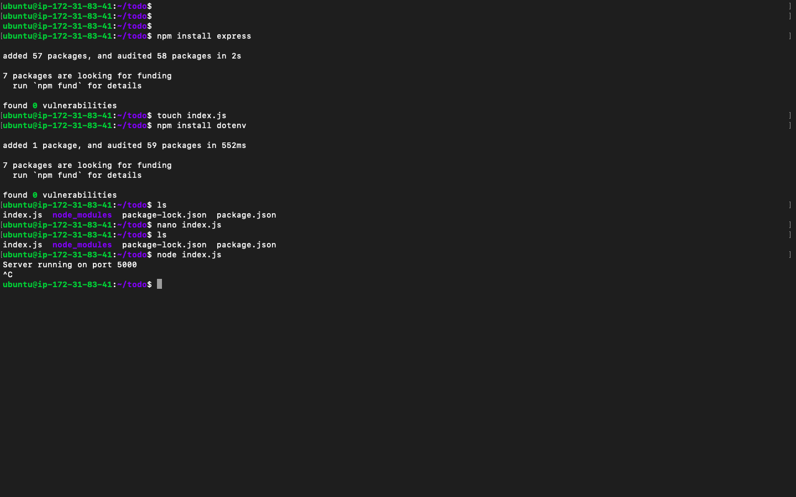

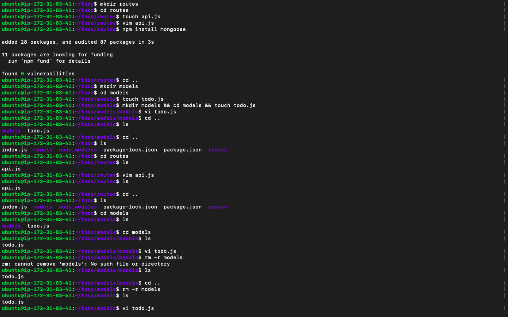


Here is the path to Delete a todo `/todos/:id`


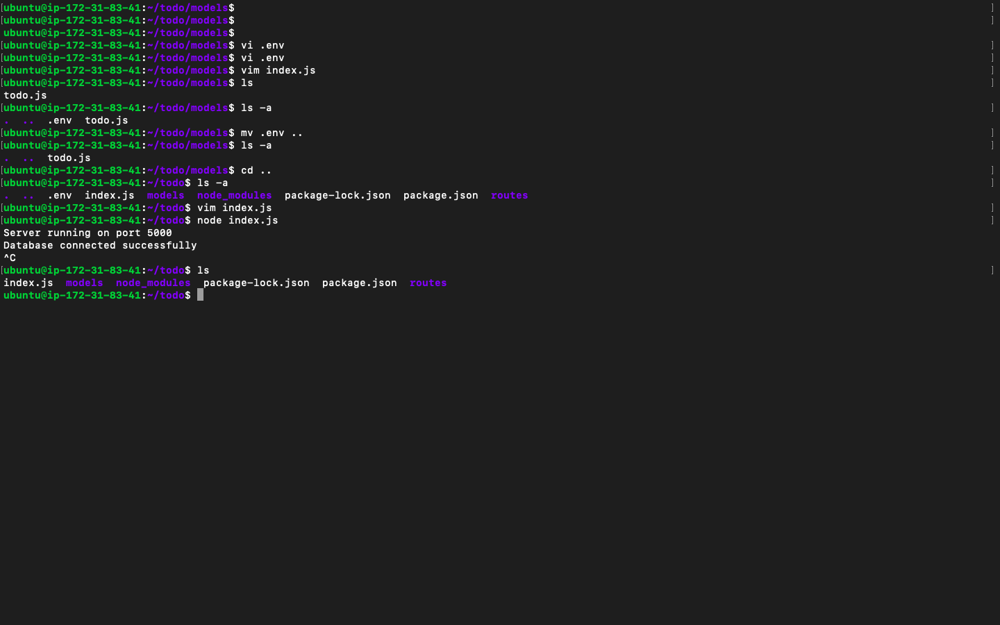

#### Backend files

`Mongodb model - todo.js`

```javascript
const mongoose = require("mongoose");
const Schema = mongoose.Schema;

//create schema for todo
const TodoSchema = new Schema({
  action: {
    type: String,
    required: [true, "The todo text field is required"],
  },
});

//create model for todo
const Todo = mongoose.model("todo", TodoSchema);

module.exports = Todo;
```

`route file - api.js`

```javascript
const express = require("express");
const router = express.Router();
const Todo = require("../models/todo");

router.get("/todos", (req, res, next) => {
  //this will return all the data, exposing only the id and action field to the client
  Todo.find({}, "action")
    .then((data) => res.json(data))
    .catch(next);
});

router.post("/todos", (req, res, next) => {
  if (req.body.action) {
    Todo.create(req.body)
      .then((data) => res.json(data))
      .catch(next);
  } else {
    res.json({
      error: "The input field is empty",
    });
  }
});

router.delete("/todos/:id", (req, res, next) => {
  Todo.findOneAndDelete({ _id: req.params.id })
    .then((data) => res.json(data))
    .catch(next);
});

module.exports = router;
```

`env file - .env`

```env
DB = 'mongodb+srv://<username>:<password>@<network-address>/<dbname>?retryWrites=true&w=majority'
```

`entry file - index.js`

```javascript
const express = require("express");
const bodyParser = require("body-parser");
const mongoose = require("mongoose");
const routes = require("./routes/api");
const path = require("path");
require("dotenv").config();

const app = express();

const port = process.env.PORT || 5000;

//connect to the database
mongoose
  .connect(process.env.DB, { useNewUrlParser: true, useUnifiedTopology: true })
  .then(() => console.log(`Database connected successfully`))
  .catch((err) => console.log(err));

//since mongoose promise is depreciated, we overide it with node's promise
mongoose.Promise = global.Promise;

app.use((req, res, next) => {
  res.header("Access-Control-Allow-Origin", "*");
  res.header(
    "Access-Control-Allow-Headers",
    "Origin, X-Requested-With, Content-Type, Accept"
  );
  next();
});

app.use(bodyParser.json());

app.use("/api", routes);

app.use((err, req, res, next) => {
  console.log(err);
  next();
});

app.listen(port, () => {
  console.log(`Server running on port ${port}`);
});
```

## FRONTEND CREATION

- Run `npx create-react-app client` in root folder

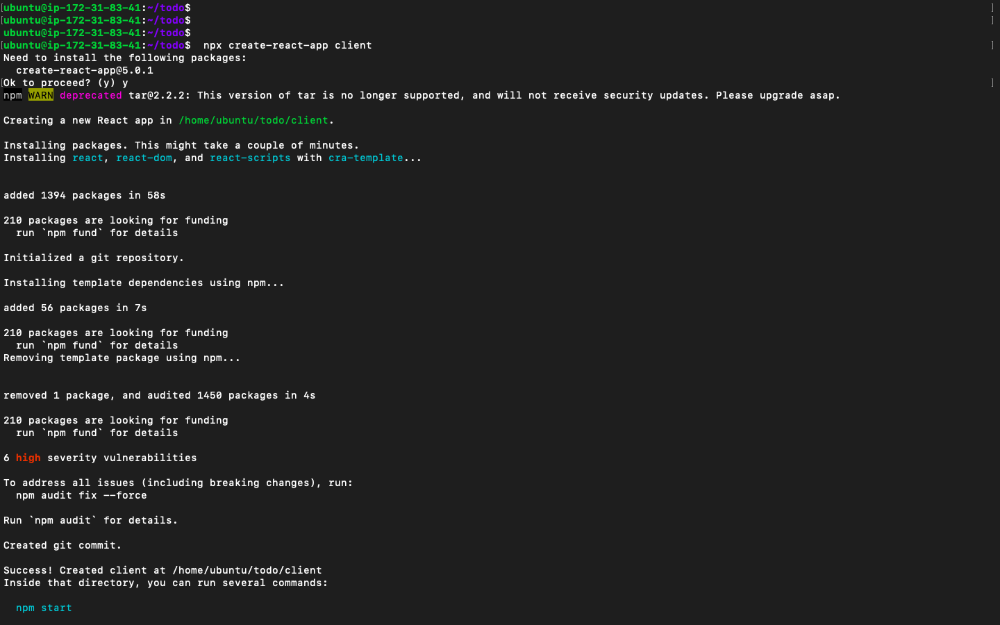

- Run `npm install concurrently nodemon --save-dev`
- In the base `package.json` file update the script with:

```json
"scripts": {
"start": "node index.js",
"start-watch": "nodemon index.js",
"dev": "concurrently \"npm run start-watch\" \"cd client && npm start\""
},
```

- Add the key value pair in the `package.json` file in the client folder.

```json
 "proxy": "http://localhost:5000"
```

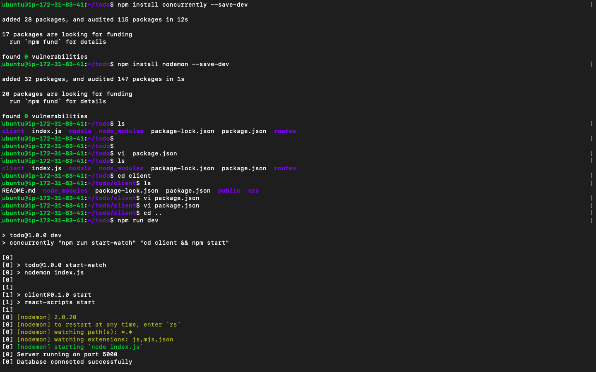

- run `npm run dev` in the root folder

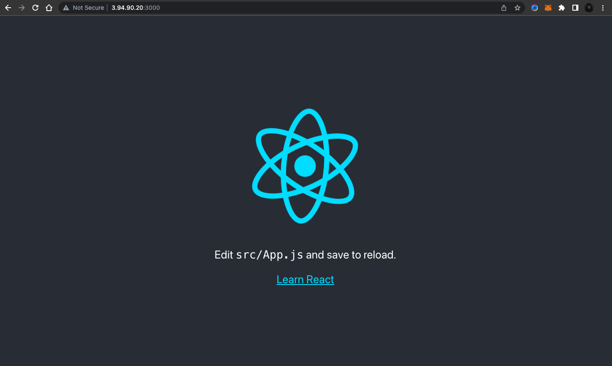

### Creating React components

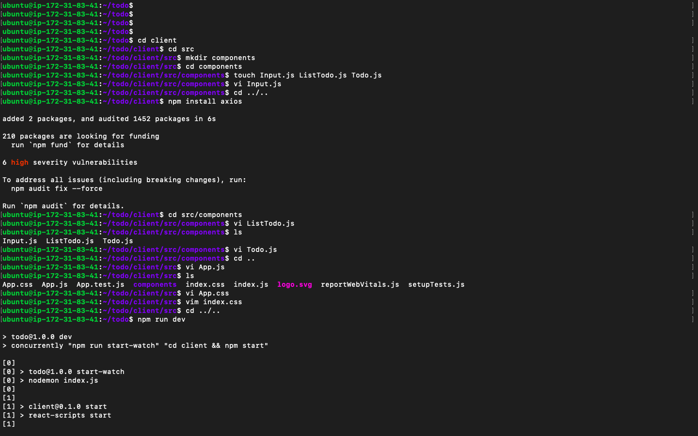


#### react files

```javascript
import React, { Component } from "react";
import axios from "axios";

class Input extends Component {
  state = {
    action: "",
  };

  addTodo = () => {
    const task = { action: this.state.action };

    if (task.action && task.action.length > 0) {
      axios
        .post("/api/todos", task)
        .then((res) => {
          if (res.data) {
            this.props.getTodos();
            this.setState({ action: "" });
          }
        })
        .catch((err) => console.log(err));
    } else {
      console.log("input field required");
    }
  };

  handleChange = (e) => {
    this.setState({
      action: e.target.value,
    });
  };

  render() {
    let { action } = this.state;
    return (
      <div>
        <input type="text" onChange={this.handleChange} value={action} />
        <button onClick={this.addTodo}>add todo</button>
      </div>
    );
  }
}

export default Input;
```

- install axios - `npm install axios`

`Componet file - ListTodo.js`

```javascript
import React from "react";

const ListTodo = ({ todos, deleteTodo }) => {
  return (
    <ul>
      {todos && todos.length > 0 ? (
        todos.map((todo) => {
          return (
            <li key={todo._id} onClick={() => deleteTodo(todo._id)}>
              {todo.action}
            </li>
          );
        })
      ) : (
        <li>No todo(s) left</li>
      )}
    </ul>
  );
};

export default ListTodo;
```

`Todo.js`

```javascript
import React, { Component } from "react";
import axios from "axios";

import Input from "./Input";
import ListTodo from "./ListTodo";

class Todo extends Component {
  state = {
    todos: [],
  };

  componentDidMount() {
    this.getTodos();
  }

  getTodos = () => {
    axios
      .get("/api/todos")
      .then((res) => {
        if (res.data) {
          this.setState({
            todos: res.data,
          });
        }
      })
      .catch((err) => console.log(err));
  };

  deleteTodo = (id) => {
    axios
      .delete(`/api/todos/${id}`)
      .then((res) => {
        if (res.data) {
          this.getTodos();
        }
      })
      .catch((err) => console.log(err));
  };

  render() {
    let { todos } = this.state;

    return (
      <div>
        <h1>My Todo(s)</h1>
        <Input getTodos={this.getTodos} />
        <ListTodo todos={todos} deleteTodo={this.deleteTodo} />
      </div>
    );
  }
}

export default Todo;
```

`App.js file`

```javascript
import React from "react";

import Todo from "./components/Todo";
import "./App.css";

const App = () => {
  return (
    <div className="App">
      <Todo />
    </div>
  );
};

export default App;
```

`App.css`

```css
.App {
  text-align: center;
  font-size: calc(10px + 2vmin);
  width: 60%;
  margin-left: auto;
  margin-right: auto;
}

input {
  height: 40px;
  width: 50%;
  border: none;
  border-bottom: 2px #101113 solid;
  background: none;
  font-size: 1.5rem;
  color: #787a80;
}

input:focus {
  outline: none;
}

button {
  width: 25%;
  height: 45px;
  border: none;
  margin-left: 10px;
  font-size: 25px;
  background: #101113;
  border-radius: 5px;
  color: #787a80;
  cursor: pointer;
}

button:focus {
  outline: none;
}

ul {
  list-style: none;
  text-align: left;
  padding: 15px;
  background: #171a1f;
  border-radius: 5px;
}

li {
  padding: 15px;
  font-size: 1.5rem;
  margin-bottom: 15px;
  background: #282c34;
  border-radius: 5px;
  overflow-wrap: break-word;
  cursor: pointer;
}

@media only screen and (min-width: 300px) {
  .App {
    width: 80%;
  }

  input {
    width: 100%;
  }

  button {
    width: 100%;
    margin-top: 15px;
    margin-left: 0;
  }
}

@media only screen and (min-width: 640px) {
  .App {
    width: 60%;
  }

  input {
    width: 50%;
  }

  button {
    width: 30%;
    margin-left: 10px;
    margin-top: 0;
  }
}
```

`index.css`

```css
body {
  margin: 0;
  padding: 0;
  font-family: -apple-system, BlinkMacSystemFont, "Segoe UI", "Roboto",
    "Oxygen", "Ubuntu", "Cantarell", "Fira Sans", "Droid Sans",
    "Helvetica Neue", sans-serif;
  -webkit-font-smoothing: antialiased;
  -moz-osx-font-smoothing: grayscale;
  box-sizing: border-box;
  background-color: #282c34;
  color: #787a80;
}

code {
  font-family: source-code-pro, Menlo, Monaco, Consolas, "Courier New",
    monospace;
}
```

## Conclusion

- In the root folder, run `npm run dev`

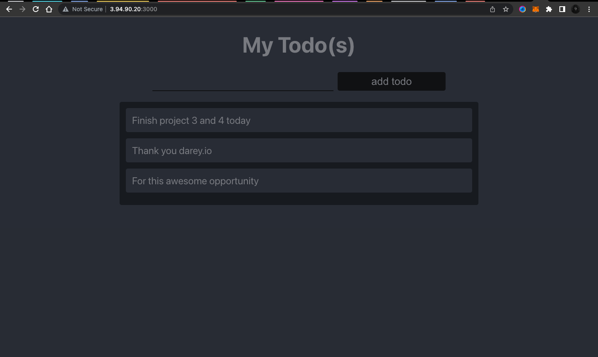