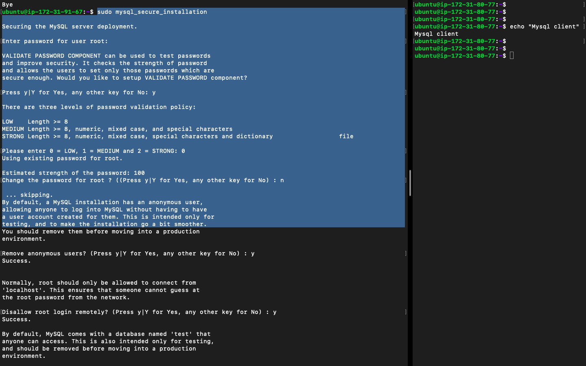
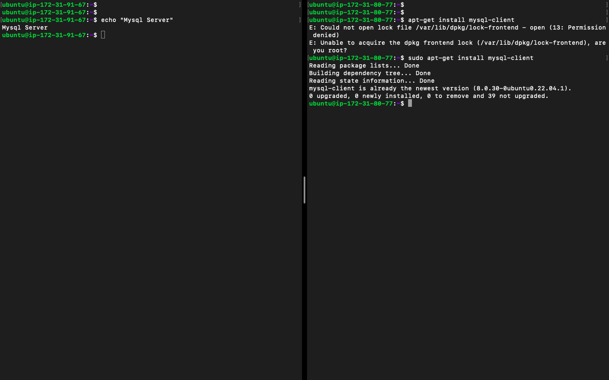
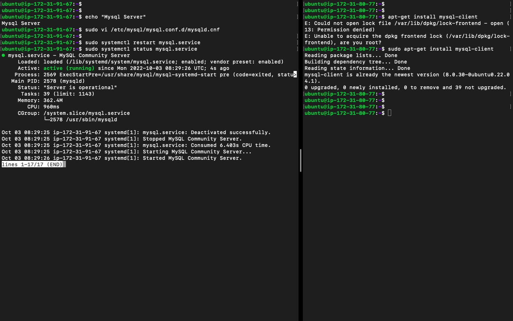
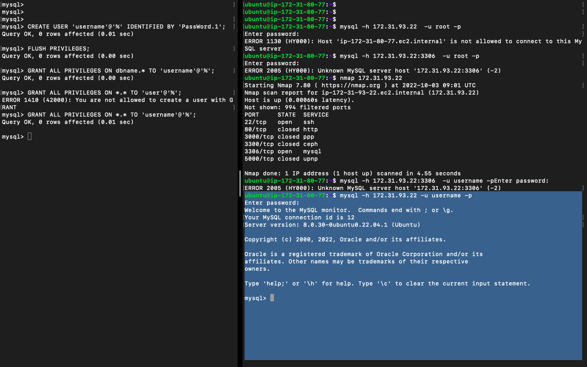
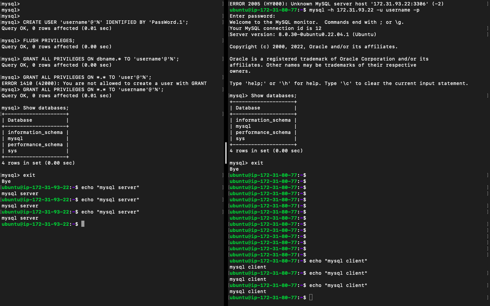

# PROJECT 5 - CLIENT/SERVER ARCHITECTURE USING A MYSQL RELATIONAL DATABASE MANAGEMENT SYSTEM


> On the server `mysql server` Don't turn off remote access while installing mysql.

### SETUP MYSQL SERVER

> The steps to take are outlined in Project 1 and 2




### SETUP MYSQL CLIENT

On the `client server` run

```bash
sudo apt update
sudo apt-get install mysql-client
```



### ACTUAL CONFIGURATION

> By default, both of your EC2 virtual servers are located in the same local virtual network, so they can communicate to each other using local IP addresses. Use mysql server's local IP address to connect from mysql client.
> MySQL server uses `TCP port 3306` by default, so you will have to open it by creating a new entry in ‘Inbound rules’ in `mysql server` Security Groups. For extra security, do not allow all IP addresses to reach your `mysql server` – allow access only to the specific local IP address of your ‘mysql client’.

- You might need to configure MySQL server to allow connections from remote hosts.

```bash
sudo vi /etc/mysql/mysql.conf.d/mysqld.cnf
```

- Replace ‘127.0.0.1’ to ‘0.0.0.0’ like this:


- Restart the server

`sudo systemctl restart mysql.service`



- Create Remote MySQL user and grant remote access to databases

```mysql
CREATE USER 'username'@'%' IDENTIFIED BY 'new-password';
FLUSH PRIVILEGES;
```

- Then you can grant access to databases using the `GRANT ALL` command: \

`GRANT ALL PRIVILEGES ON dbname.* TO 'username'@'%';`

- If you want to grant access to all databases on the server, run:\
  `GRANT ALL PRIVILEGES ON *.* TO 'user'@'%';`

- Once connected run\
  `Show databases;`

- On the mysql client run the command `mysql -h <host> -u <username> -p`
  

  

  
