# PROJECT 6 - WEB SOLUTION WITH WORDPRESS

- Setup 2 ec2 instances (web and db server)

- Create 3 volumes and attach to the webserver instance.


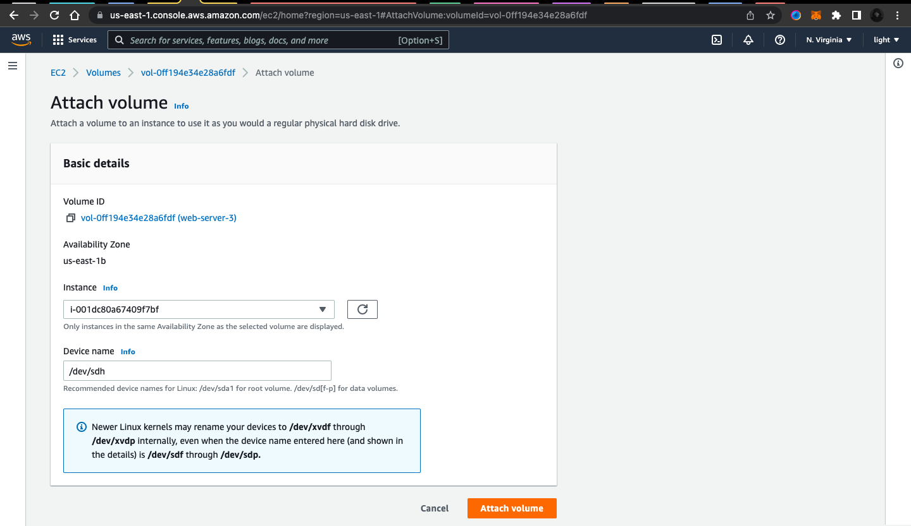

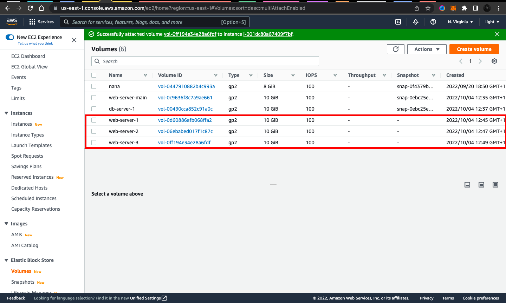

- Connnect to the instance


- Use `lsblk` command to inspect what block devices are attached to the server. Notice names of your newly created devices. All devices in Linux reside in `/dev/` directory. Inspect it with `ls /dev/` and make sure you see all 3 newly created block devices there – their names will likely be `xvdf`, `xvdh`, `xvdg`


- Use `df -h` command to see all mounts and free space on your server

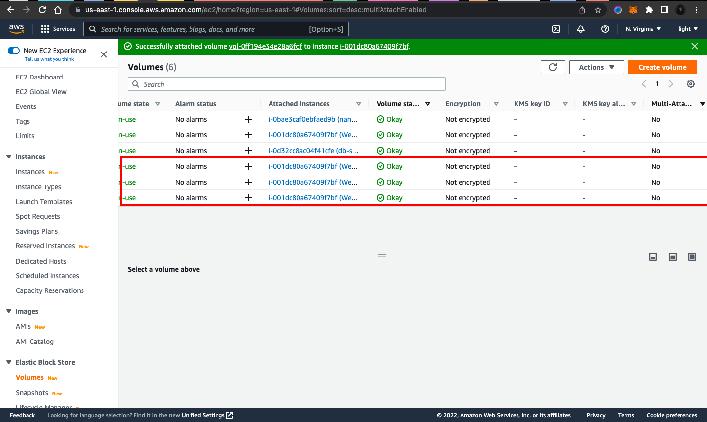

- Use gdisk to create partition on each of the disks

  `sudo gdisk /dev/xvdf`

> See image for futher commands


- Run `sudo yum install lvm2` to install `lvm2` used to check for available partitions.

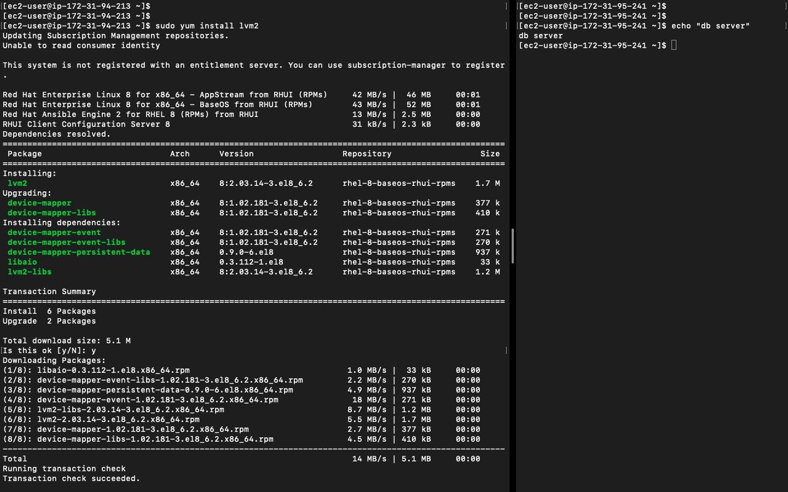

- Run `sudo lvmdiskscan` command to check for available partitions.

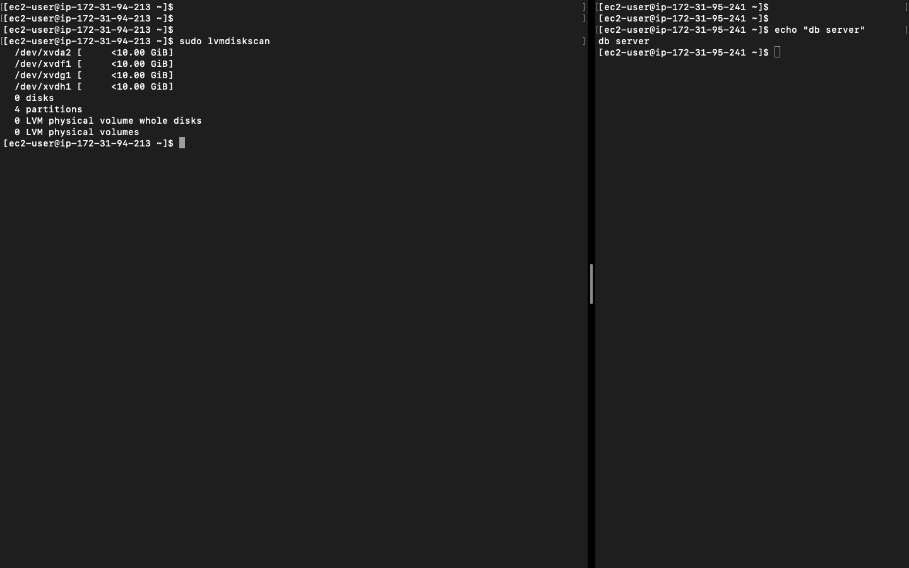

- Use `pvcreate` utility to mark each of 3 disks as physical volumes (PVs) to be used by LVM

```bash
sudo pvcreate /dev/xvdf1
sudo pvcreate /dev/xvdg1
sudo pvcreate /dev/xvdh1
```

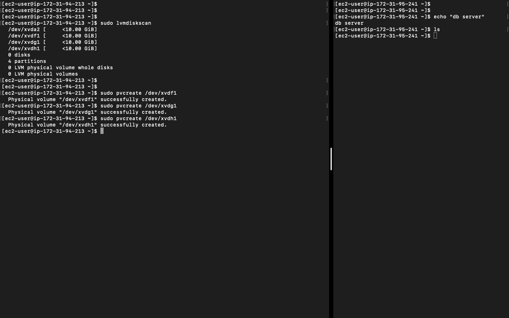

- Verify that your Physical volume has been created successfully by running

`sudo pvs`

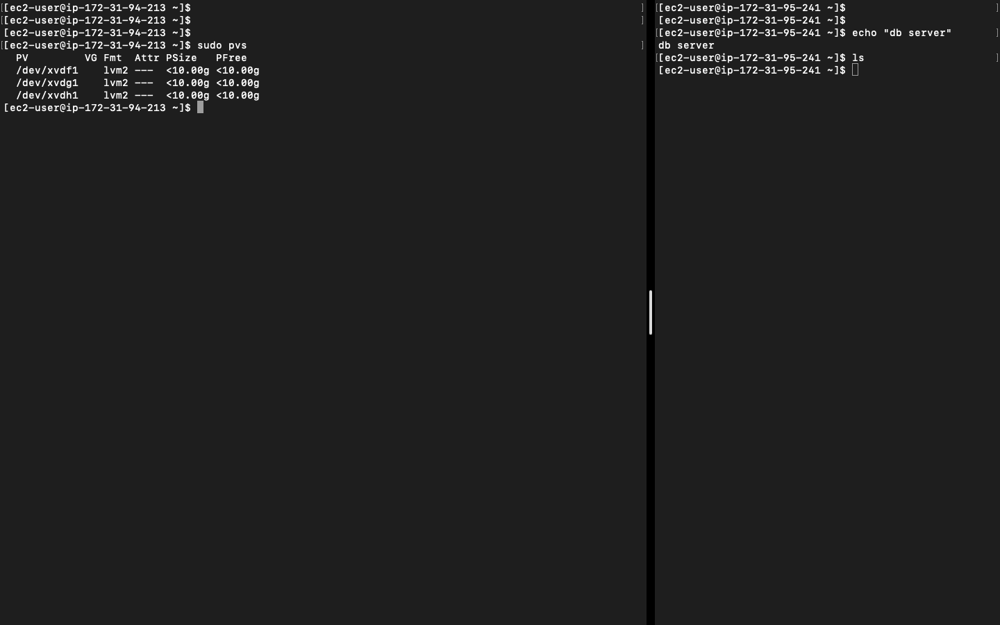

- Use `vgcreate` utility to add all 3 PVs to a volume group (VG). Name the VG

`webdata-vg`

`sudo vgcreate webdata-vg /dev/xvdh1 /dev/xvdg1 /dev/xvdf1`

- Verify that your VG has been created successfully by running

`sudo vgs`

- Use `lvcreate` utility to create 2 logical volumes. `apps-lv` (Use half of the PV size), and `logs-lv` Use the remaining space of the PV size. **NOTE:** `apps-lv` will be used to store data for the Website while, `logs-lv` will be used to store data for logs.

```bash
sudo lvcreate -n apps-lv -L 14G webdata-vg
sudo lvcreate -n logs-lv -L 14G webdata-vg
```

- Verify that your Logical Volume has been created successfully by running

`sudo lvs`

- Verify the entire setup

```bash
sudo vgdisplay -v #view complete setup - VG, PV, and LV
sudo lsblk
```


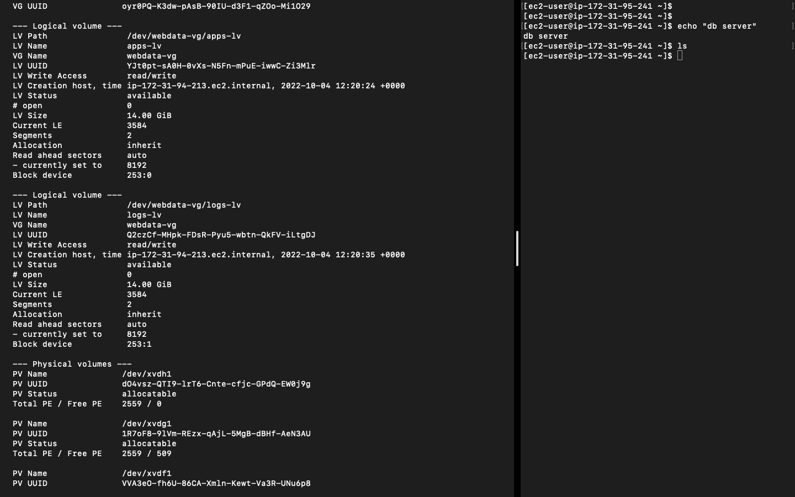


- Use `mkfs.ext4to` format the logical volumes with `ext4` filesystem

```bash
sudo mkfs -t ext4 /dev/webdata-vg/apps-lv
sudo mkfs -t ext4 /dev/webdata-vg/logs-lv
```


- Create `/var/www/html` directory to store website files

`sudo mkdir -p /var/www/html`

- Create `/home/recovery/logs` to store backup of log data

`sudo mkdir -p /home/recovery/logs`


- Mount `/var/www/html` on apps-lv logical volume

`sudo mount /dev/webdata-vg/apps-lv /var/www/html/`

- Use rsync utility to backup all the files in the log directory `/var/log` into `/home/recovery/logs` _(This is required before mounting the file system)_

`sudo rsync -av /var/log/. /home/recovery/logs/`

- Mount `/var/log` on `logs-lv` logical volume. _(Note that all the existing data on /var/log will be deleted. That is why step 15 above is very important)_

`sudo mount /dev/webdata-vg/logs-lv /var/log`

- Restore log files back into `/var/log` directory

`sudo rsync -av /home/recovery/logs/. /var/log`


- Update `/etc/fstab` file so that the mount configuration will persist after restart of the server.

---

## UPDATE THE `/ETC/FSTAB` FILE

- Get the UUID of the device which will be used to update the `/etc/fstab` File

`sudo blkid`

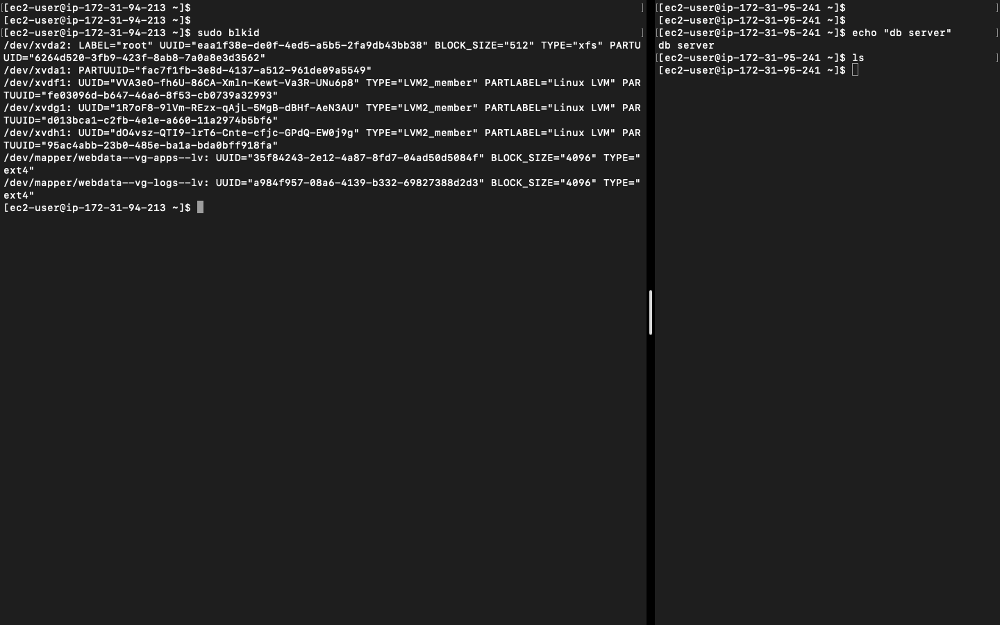

- Copy the uuid of the logical volumes

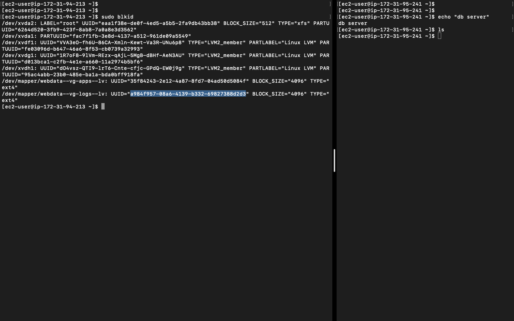

- Open the `/etc/fstab` file and paste in this

```config
UUID=<uuid for lv>       /var/www/html   ext4    defaults        0       0
UUID=<uuid for lv>       /var/log   ext4    defaults        0       0
```

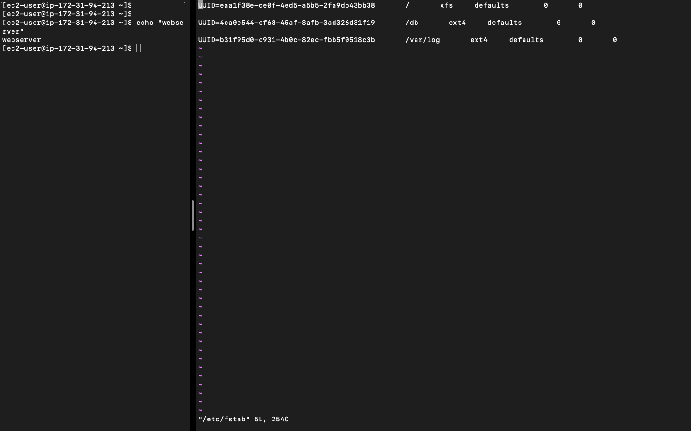

- Test the configuration and reload the daemon

```bash
sudo mount -a
sudo systemctl daemon-reload
```

- Verify your setup by running `df -h`


---

## SETUP DB SERVER

- Launch a second RedHat EC2 instance that will have a role – ‘DB Server’


> Repeat the same steps as for the Web Server, but instead of `apps-lv` create `db-lv` and mount it to `/db` directory instead of `/var/www/html/`

- To view all commands, watch this video

[Video of Full DB Server Setup Command - _(Same setup as the web server)_](https://drive.google.com/file/d/1XYcZ6O8h2iYEzrzVrXO0FfgqYoaRhzET/view?usp=sharing)


---

## INSTALL WORDPRESS ON YOUR WEB SERVER EC2

- Update the repository

`sudo yum -y update`

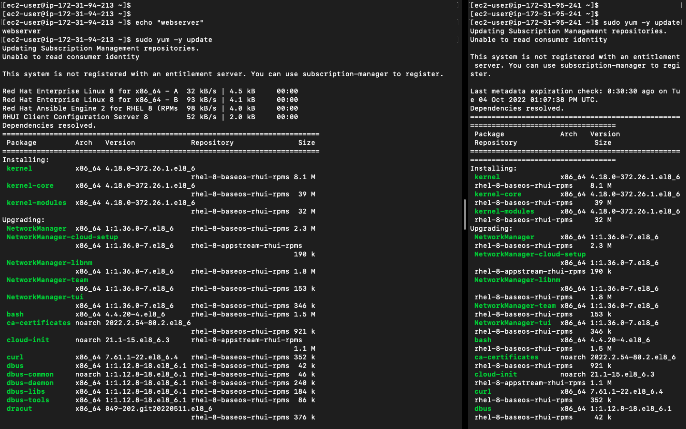

- Install wget, Apache and it’s dependencies

`sudo yum -y install wget httpd php php-mysqlnd php-fpm php-json`


- Start Apache

```bash
sudo systemctl enable httpd
sudo systemctl start httpd
```

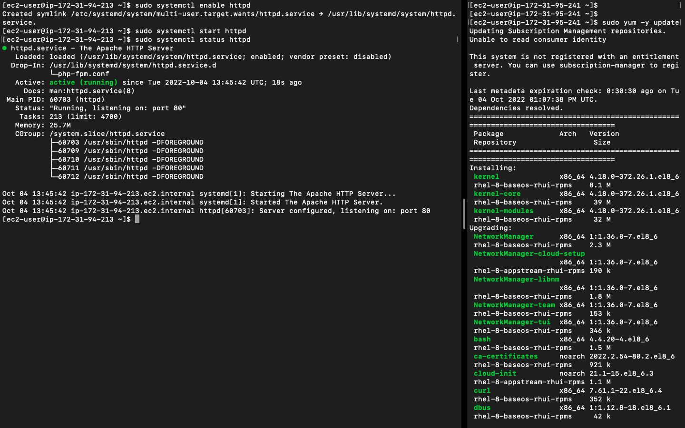

- To install PHP and it’s depemdencies

```bash
sudo yum install https://dl.fedoraproject.org/pub/epel/epel-release-latest-8.noarch.rpm
sudo yum install yum-utils http://rpms.remirepo.net/enterprise/remi-release-8.rpm
sudo yum module list php
sudo yum module reset php
sudo yum module enable php:remi-7.4
sudo yum install php php-opcache php-gd php-curl php-mysqlnd
sudo systemctl start php-fpm
sudo systemctl enable php-fpm
setsebool -P httpd_execmem 1
```


- Restart Apache

`sudo systemctl restart httpd`

- Download wordpress and copy wordpress to `/var/www/html`

```bash
mkdir wordpress
cd   wordpress
sudo wget http://wordpress.org/latest.tar.gz
sudo tar xzvf latest.tar.gz
sudo rm -rf latest.tar.gz
cp wordpress/wp-config-sample.php wordpress/wp-config.php
cp -R wordpress /var/www/html/
```


- Configure SELinux Policies

```bash
sudo chown -R apache:apache /var/www/html/wordpress
sudo chcon -t httpd_sys_rw_content_t /var/www/html/wordpress -R
sudo setsebool -P httpd_can_network_connect=1
```


### INSTALL MYSQL ON YOUR DB SERVER EC2

```bash
sudo yum update
sudo yum install mysql-server
```

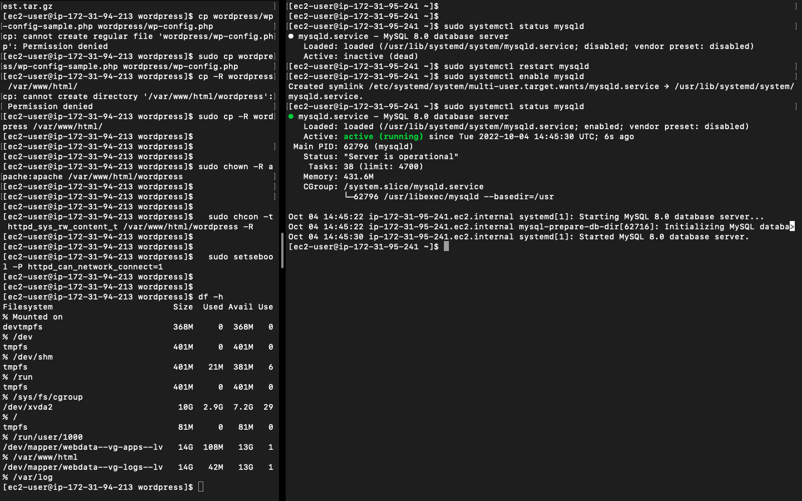

- Verify that the service is up and running by using `sudo systemctl status mysqld`, if it is not running, restart the service and enable it so it will be running even after reboot:

```bash
sudo systemctl restart mysqld
sudo systemctl enable mysqld
```


---

## CONFIGURE DB TO WORK WITH WORDPRESS

```sql
sudo mysql
CREATE DATABASE wordpress;
CREATE USER `myuser`@`<Web-Server-Private-IP-Address>` IDENTIFIED BY 'mypass';
GRANT ALL ON wordpress.* TO 'myuser'@'<Web-Server-Private-IP-Address>';
FLUSH PRIVILEGES;
SHOW DATABASES;
exit
```


## CONFIGURE WORDPRESS TO CONNECT TO REMOTE DATABASE.

> Hint: Do not forget to open MySQL port 3306 on DB Server EC2. For extra security, you shall allow access to the DB server ONLY from your Web Server’s IP address, so in the Inbound Rule configuration specify source as /32

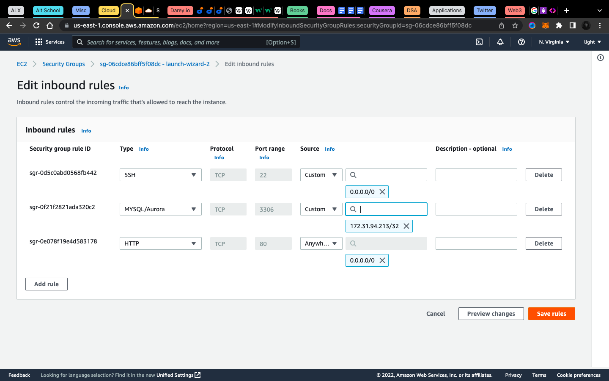


- Install MySQL client and test that you can connect from your Web Server to your DB server by using mysql-client

```bash
sudo yum install mysql
sudo mysql -u admin -p -h <DB-Server-Private-IP-address>
```

- Verify if you can successfully execute `SHOW DATABASES;`command and see a list of existing databases.


- Change permissions and configuration so Apache could use WordPress _(I deleted the `wp-config.php` file, and generated a new one automatically from the wordpress UI after filling the required information)_

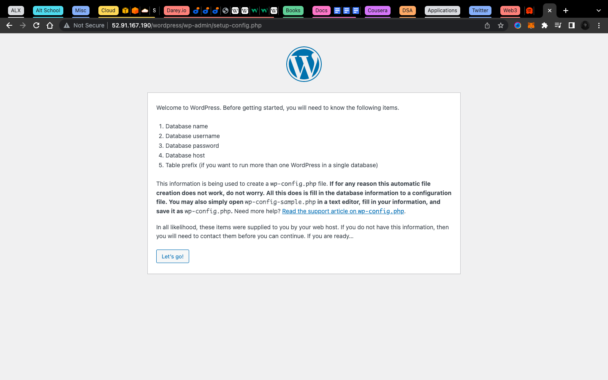

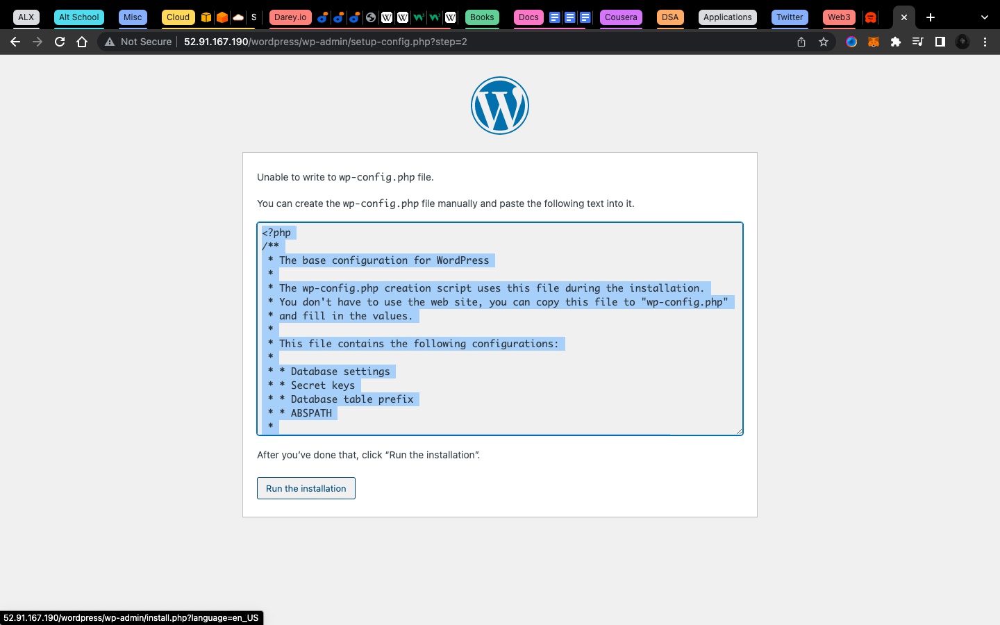

> Enable TCP port 80 in Inbound Rules configuration for your Web Server EC2 (enable from everywhere 0.0.0.0/0 or from your workstation’s IP)

- Try to access from your browser the link to your WordPress http://<Web-Server-Public-IP-Address>/wordpress/


